<div align="center">

# Keeper 项目白皮书

### 智能运维 Agent — 一个"会自己动手"的对话式运维助手

**版本：** v1.1.1　|　**文档类型：** 项目白皮书 / 架构设计报告
**适用读者：** 从完全没接触过本项目的新人，到希望深入理解架构的工程师

</div>

---

> 本白皮书力求"一篇读懂 Keeper"：既让**没有背景知识的读者**也能明白它是什么、能干什么、怎么用；也为**工程师**提供完整的架构设计、时序图、模块剖析和优缺点评估。
>
> 文档中的所有架构图与时序图均使用 [Mermaid](https://mermaid.js.org/) 绘制，可在 GitHub / 支持 Mermaid 的 Markdown 阅读器中直接渲染查看。

---

## 目录

1. [项目概览：Keeper 是什么](#第一章-项目概览keeper-是什么)
2. [五分钟快速上手](#第二章-五分钟快速上手)
3. [整体架构设计](#第三章-整体架构设计)
4. [核心引擎详解：Hybrid Agent](#第四章-核心引擎详解hybrid-agent)
5. [关键流程时序图](#第五章-关键流程时序图)
6. [模块逐一详解](#第六章-模块逐一详解)
7. [安全设计专题](#第七章-安全设计专题)
8. [配置与持久化](#第八章-配置与持久化)
9. [工具体系](#第九章-工具体系)
10. [可观测性：审计、记忆与日志](#第十章-可观测性审计记忆与日志)
11. [扩展机制：Runbook / 插件 / 国际化](#第十一章-扩展机制runbook--插件--国际化)
12. [测试与工程质量](#第十二章-测试与工程质量)
13. [设计优缺点总评与改进建议](#第十三章-设计优缺点总评与改进建议)
14. [附录：术语表与速查](#第十四章-附录术语表与速查)

---

## 第一章 项目概览：Keeper 是什么

### 1.1 一句话介绍

> **Keeper 是一个运行在终端里的"对话式智能运维助手"。你用大白话告诉它要做什么（比如"看看服务器为什么变慢了"），它会像一位资深运维工程师一样，自己分析问题、自己敲命令、自己看结果，一步步排查直到给你结论和修复建议。**

如果你用过 **Claude Code**（在终端里用自然语言写代码的 AI 工具），那么可以这样理解：

> **Claude Code 之于"写代码"，相当于 Keeper 之于"运维服务器"。**

### 1.2 它解决什么问题？

传统运维（手动操作服务器）有几个典型痛点：

| 传统运维的痛点 | Keeper 的做法 |
| --- | --- |
| 需要背大量命令（`top`、`journalctl`、`kubectl`…）和参数 | 用中文/自然语言描述需求即可，命令由 AI 生成 |
| 排查问题靠经验，要一步步手动敲命令、看输出、再决定下一步 | AI 自动"多步推理"：执行 → 看结果 → 决定下一步，循环到解决 |
| 新人不知道排查思路（CPU 高了先看什么？） | 内置排查模板 + LLM 经验，自动给出排查路线 |
| 危险命令（`rm -rf`）容易误删，没有保护 | 内置四级安全检查，高危命令直接拦截，写操作需确认 |
| 标准操作流程（SOP）写在文档里，执行靠人 | Runbook 引擎把 SOP 变成可一键执行、可被 AI 调度的"技能" |

### 1.3 一个直观的例子

你在终端里输入一句话，Keeper 自己完成了一次完整的排查：

```text
keeper🤖> 分析一下为什么 CPU 高

[排查路线: 检查服务器整体资源状态 → 获取 CPU 占用最高的进程 → 查看异常进程对应的服务日志]

  🔧 inspect_server(localhost)        ✓ (123ms)
       CPU: 92% ⚠️   内存: 45%   磁盘: 60%
  🔧 get_top_processes(n=20)          ✓ (40ms)
       1. mysql (PID:1234) CPU:85%
  🔧 query_system_logs(unit=mysql, priority=err)  ✓ (88ms)
       [发现] 大量 slow query 日志

## 分析结论
根因：MySQL 慢查询导致 CPU 飙升至 92%
建议：
  1. 查看慢查询日志定位具体 SQL
  2. 考虑添加索引或优化查询
  3. 临时方案：限制连接数
```

注意这里发生了什么：**你只说了一句话**，Keeper 自己决定了"先查整机状态、再看进程、再看日志"这三步，每一步都调用了不同的工具，最后综合所有信息给出了根因和建议。这就是"Agent（智能体）"的核心——**自主决策 + 多步执行**。

### 1.4 核心特性速览

- 🗣️ **自然语言驱动**：用中文对话即可，无需记命令。
- 🤖 **自主多步推理**：基于 LLM 的 ReAct 循环，自己规划、自己执行、自己纠错。
- 🧰 **28+ 内置工具**：覆盖服务器巡检、K8s、Docker、网络、安全扫描、SSL 证书、日志、进程管理等。
- 🛡️ **四级安全管控**：高危命令拦截、写操作确认，保护生产环境。
- 🪜 **三级降级架构**：从最智能到最保底层层兜底，保证"总能用"。
- 🧭 **自服务引导**：缺依赖、连不上时不是冷冰冰报错，而是引导你一步步解决。
- 📚 **Runbook 运维手册**：把标准操作流程（SOP）变成可执行、可被 AI 调度的技能，支持动态安装。
- 🧠 **跨会话记忆**：记住历史操作，"上次也是这个问题"。
- 🌐 **多种使用形态**：交互式对话、单命令执行、HTTP API / WebSocket、定时任务。

### 1.5 适用场景与边界

**适合：**
- 个人/小团队的服务器日常巡检与故障排查
- 开发、测试环境的快速诊断
- K8s / Docker 集群的状态检查与常见运维操作
- 把团队 SOP 沉淀为可复用、可自动执行的 Runbook

**当前边界（设计取舍，详见第十三章）：**
- 智能分析能力依赖 LLM API（需联网与 API Key）；但本地巡检、Docker、K8s 等"动手"能力不依赖 LLM。
- 主要面向 Linux 运维场景（命令、白名单、CIS 检查均以 Linux 为主）。
- 不是无人值守的全自动运维平台，写/破坏性操作默认需要人工确认。

---

## 第二章 五分钟快速上手

本章带你从零跑起来。即使你只是想"先用起来看看"，照着做即可。

### 2.1 它需要什么环境？

- **Python ≥ 3.9**
- 一个 **LLM API Key**（用于智能分析）。支持两类：
  - **OpenAI 兼容 API**：如 DeepSeek、豆包、通义千问等国产模型，或 OpenAI 本身。
  - **Anthropic API**：Claude 系列。
- 操作系统：Linux（推荐）。本地巡检基于 `psutil`，跨平台可运行，但运维命令以 Linux 为主。

> 💡 没有 API Key 也能玩：运行 `python demo.py` 可以体验离线演示；或用 `keeper --classic` 经典模式跑不依赖 LLM 的确定性指令。

### 2.2 安装

**方式一：一键安装（最简单）**

```bash
curl -sSL https://raw.githubusercontent.com/seventhocean/Keeper/main/install.sh | bash
```

**方式二：开发者安装（推荐想看源码/二次开发的人）**

```bash
git clone https://github.com/seventhocean/Keeper.git
cd Keeper
python -m venv venv && source venv/bin/activate
pip install -e ".[dev]"      # 安装本体 + 开发依赖
# 可选：pip install -e ".[k8s,api]"  额外装 K8s SDK 和 API 服务依赖
```

安装完成后，你的系统里就有了一个 `keeper` 命令（这是由 `pyproject.toml` 里的 `[project.scripts]` 注册的入口 `keeper = keeper.cli:main`）。

### 2.3 第一次启动与配置

直接运行：

```bash
keeper
```

如果是第一次用且还没配 API Key，Keeper 会**自动进入交互式配置向导**，你只需要粘贴三样东西（后两样有默认值，可回车跳过）：

```text
⚡ 首次使用？需要配置 LLM API Key。

   API Key (输入跳过): sk-xxxxxxxx
   Base URL [https://api.qnaigc.com/v1]:        ← 直接回车用默认，或填你的
   Model [deepseek/deepseek-v3.2-251201]:        ← 直接回车用默认，或填你的

✓ LLM 配置已保存！
🤖 Keeper Agent 模式已启动
```

配置会被保存到 `~/.keeper/config.yaml`。你也可以随时用命令行手动配置：

```bash
keeper config set --api-key YOUR_KEY --base-url https://api.xxx.com/v1 --model claude-sonnet-4-6
keeper status        # 查看当前配置是否就绪
```

### 2.4 开始对话

进入 `keeper🤖>` 提示符后，直接说人话：

```text
keeper🤖> 检查本机服务器状态
keeper🤖> 测试 8.8.8.8 的网络延迟
keeper🤖> 看看 /etc/nginx/nginx.conf 写了什么
keeper🤖> 磁盘满了，帮我清理一下
keeper🤖> 检查 K8s 集群有没有异常
```

对话中还有一组以 `/` 开头的**特殊命令**（不消耗 LLM，瞬间响应）：

| 命令 | 作用 |
| --- | --- |
| `/clear` | 清空当前对话历史 |
| `/history` | 查看上一次执行的工具调用详情 |
| `/tools` | 列出所有可用工具 |
| `/mode` | 查看当前运行模式（langgraph/manual） |
| `/memory` | 查看跨会话的历史操作记忆 |
| `/status` | 查看 Agent 运行状态 |
| `/plugins` | 查看已安装的用户插件 |
| `退出` / `exit` / Ctrl+D | 结束会话 |

### 2.5 除了"对话"，还能怎么用？

Keeper 提供了多种"使用形态"，适应不同场景：

```bash
# 形态 1：交互式对话（默认）
keeper

# 形态 2：单条命令，跑完即退出（适合脚本/CI）
keeper run 检查本机
keeper run 扫描漏洞 --host 192.168.1.100

# 形态 3：直接执行 Shell（本地或远程 SSH）
keeper exec -- df -h /
keeper exec --host 192.168.1.100 -- uptime

# 形态 4：专用子命令（不需要 LLM 也能用）
keeper k8s inspect              # K8s 集群巡检
keeper docker ls                # Docker 容器列表
keeper network ping 8.8.8.8     # 网络诊断
keeper cert check-domain a.com  # SSL 证书检查
keeper logs --hours 24          # 查看操作审计日志
keeper runbook list             # 查看运维手册

# 形态 5：HTTP API 服务（给其他系统集成调用）
python -m keeper.api.server     # 默认监听 http://0.0.0.0:8900，含 /docs 文档
```

### 2.6 一张图建立"心智模型"

在深入技术细节前，先建立一个直觉：**你说的每一句话，Keeper 会先尝试用"最快最省"的方式处理，处理不了才动用"最聪明最贵"的 AI 大脑，AI 出问题了还有"保底方案"。**

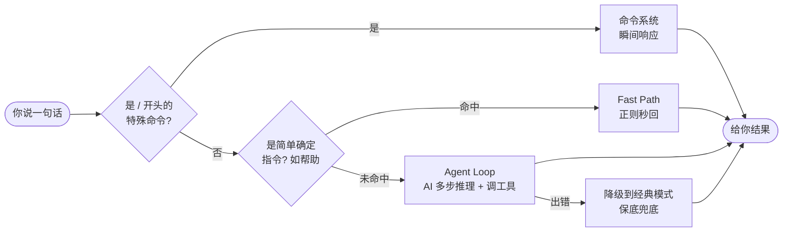
```mermaid
flowchart LR
    U([你说一句话]) --> A{是 / 开头的<br/>特殊命令?}
    A -- 是 --> C1[命令系统<br/>瞬间响应]
    A -- 否 --> B{是简单确定<br/>指令? 如帮助}
    B -- 命中 --> C2[Fast Path<br/>正则秒回]
    B -- 未命中 --> C3[Agent Loop<br/>AI 多步推理 + 调工具]
    C3 -- 出错 --> C4[降级到经典模式<br/>保底兜底]
    C1 --> R([给你结果])
    C2 --> R
    C3 --> R
    C4 --> R
```

记住这个"快→智能→保底"的三段式，后面的架构就很好理解了。


---

## 第三章 整体架构设计

### 3.1 分层架构总览

Keeper 在结构上可以分为五大层次，从上到下分别是：**接入层 → 编排层 → 能力层 → 基础设施层 → 持久化层**。

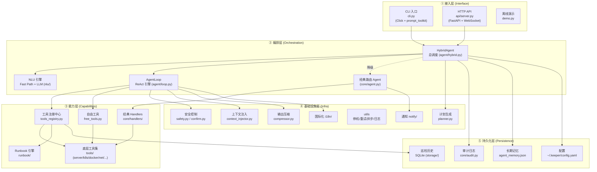
```mermaid
flowchart TB
    subgraph L1["① 接入层 (Interface)"]
        CLI["CLI 入口<br/>cli.py<br/>(Click + prompt_toolkit)"]
        API["HTTP API<br/>api/server.py<br/>(FastAPI + WebSocket)"]
        DEMO["离线演示<br/>demo.py"]
    end

    subgraph L2["② 编排层 (Orchestration)"]
        HYB["HybridAgent<br/>总调度 (agent/hybrid.py)"]
        LOOP["AgentLoop<br/>ReAct 引擎 (agent/loop.py)"]
        CLASSIC["经典路由 Agent<br/>(core/agent.py)"]
        NLU["NLU 引擎<br/>Fast Path + LLM (nlu/)"]
    end

    subgraph L3["③ 能力层 (Capabilities)"]
        REGISTRY["工具注册中心<br/>tools_registry.py"]
        FREE["自由工具<br/>free_tools.py"]
        TOOLS["底层工具集<br/>tools/ (server/k8s/docker/net/...)"]
        RUNBOOK["Runbook 引擎<br/>runbook/"]
        HANDLERS["经典 Handlers<br/>core/handlers/"]
    end

    subgraph L4["④ 基础设施层 (Infra)"]
        SAFETY["安全控制<br/>safety.py / confirm.py"]
        CTX["上下文注入<br/>context_injector.py"]
        COMP["输出压缩<br/>compressor.py"]
        PLAN["计划生成<br/>planner.py"]
        UTILS["utils<br/>停机/重试/异步/日志"]
        I18N["国际化 i18n/"]
        NOTIFY["通知 notify/"]
    end

    subgraph L5["⑤ 持久化层 (Persistence)"]
        CONFIG["配置<br/>~/.keeper/config.yaml"]
        AUDIT["审计日志<br/>core/audit.py"]
        MEM["长期记忆<br/>agent_memory.json"]
        HIST["巡检历史<br/>SQLite (storage/)"]
    end

    CLI --> HYB
    API --> HYB
    HYB --> NLU
    HYB --> LOOP
    HYB -. 降级 .-> CLASSIC
    LOOP --> REGISTRY
    LOOP --> FREE
    CLASSIC --> HANDLERS
    REGISTRY --> TOOLS
    FREE --> TOOLS
    HANDLERS --> TOOLS
    REGISTRY --> RUNBOOK
    LOOP --> SAFETY
    LOOP --> CTX
    LOOP --> COMP
    HYB --> PLAN
    LOOP --> I18N
    CLASSIC --> NOTIFY
    REGISTRY --> HIST
    HYB --> AUDIT
    HYB --> MEM
    HYB --> CONFIG
```

各层职责：

| 层次 | 职责 | 关键文件 |
| --- | --- | --- |
| **① 接入层** | 接收用户输入（终端 / HTTP / 离线），负责输入输出与展示 | `cli.py`、`api/server.py`、`demo.py` |
| **② 编排层** | 决定"怎么处理这句话"：分流、规划、调度、降级 | `agent/hybrid.py`、`agent/loop.py`、`core/agent.py`、`nlu/` |
| **③ 能力层** | 真正"动手"的地方：调用工具完成具体运维操作 | `agent/tools_registry.py`、`tools/`、`runbook/`、`core/handlers/` |
| **④ 基础设施层** | 横切能力：安全、上下文、压缩、计划、通知、国际化 | `agent/safety.py`、`context_injector.py`、`compressor.py` 等 |
| **⑤ 持久化层** | 把状态/历史落盘，跨会话复用 | `config.py`、`core/audit.py`、`agent/memory.py`、`storage/` |

### 3.2 模块全景与目录结构

```text
keeper/
├── cli.py                 接入层：Click 命令组 + prompt_toolkit REPL（所有 keeper xxx 子命令）
├── config.py              配置中心：AppConfig/LLMConfig，YAML + 跨平台文件锁
├── exceptions.py          统一异常定义
│
├── agent/                 ★ Agent 引擎（项目核心，类 Claude Code）
│   ├── hybrid.py              总调度：Fast Path + Agent Loop + 降级 + 审计 + 记忆
│   ├── loop.py                ReAct 引擎：LangGraph / 手动双模式 + 流式 + 确认包装
│   ├── tools_registry.py      工具注册中心：@tool + ToolMeta + 动态 Runbook/插件注册
│   ├── free_tools.py          5 个自由工具（run_bash/read_file/write_file/list_dir/search）
│   ├── safety.py              四级安全：命令正则黑/灰/白名单 + 工具权限表
│   ├── confirm.py             交互确认：prompt_toolkit RadioList（allow/deny/always）
│   ├── planner.py             6 个排查模板 + 动态计划生成
│   ├── memory.py              长期记忆（JSON，跨会话，最多 100 条）
│   ├── context_injector.py    上下文注入器（主机/任务/记忆，5 分钟 TTL 缓存）
│   ├── compressor.py          工具输出四级压缩管线（trim/summarize/fold/stats）
│   ├── state.py               状态总线 + TodoWrite 任务追踪
│   ├── commands.py            斜杠命令系统（/clear /tools /memory ...）
│   ├── ask_user.py            结构化提问解析（SSH/K8s/安装引导）
│   ├── plugins.py             用户自定义工具插件发现（~/.keeper/plugins/）
│   └── compressor.py          （见上）
│
├── core/                  ★ 经典路由器（降级兜底）
│   ├── agent.py               意图分发 + 待确认任务 + 内置定时任务调度
│   ├── audit.py               审计日志（JSON Lines + 自动轮转）
│   ├── context.py             短期记忆 + 上下文管理
│   └── handlers/              11 个意图处理器（inspect/k8s/docker/network/...）
│
├── nlu/                   语义理解：23+ 意图类型 + 约 26 条 Fast Path 正则 + LLM 巨型提示词
│   ├── base.py                IntentType 枚举 + ParsedIntent 数据结构
│   └── langchain_engine.py    LangChain LLM 引擎（OpenAI 兼容 / Anthropic）
│
├── tools/                 ★ 底层工具集（20+ 模块）
│   ├── server.py              服务器巡检（psutil）+ 状态报告
│   ├── k8s/                   K8s 子模块（client/inspector/ops/logs/formatter）
│   ├── docker_tools.py        Docker 容器/镜像管理
│   ├── network.py             Ping/端口/DNS/HTTP 诊断
│   ├── scanner.py             Nmap 端口/漏洞扫描
│   ├── cert_monitor.py        SSL/TLS 证书监控
│   ├── ssh.py                 SSH 远程执行（paramiko）
│   ├── rca.py                 根因分析引擎
│   ├── fixer.py               修复建议生成（含安全分级）
│   ├── alert.py               告警规则引擎
│   ├── capacity.py            容量预测（线性回归）
│   ├── comparator.py          巡检历史对比
│   ├── scheduler.py           定时任务调度
│   ├── reporter.py            报告导出（JSON/HTML）
│   ├── log_analyzer.py        日志智能分析（错误聚合）
│   ├── snapshot.py            执行前状态快照
│   └── timeline.py            事件时间线构建
│
├── runbook/               YAML 运维手册引擎（3 内置模板 + 用户动态安装）
├── api/                   FastAPI REST + WebSocket 服务
├── compliance/            CIS Benchmark 安全合规（15 项检查）+ 配置漂移
├── integrations/          Prometheus Alertmanager 集成
├── knowledge/             故障模式知识库（fault_patterns.yaml）
├── notify/                多通道通知路由（飞书/钉钉/企业微信）
├── storage/               SQLite 巡检历史
├── i18n/                  中英文语言包
└── utils/                 优雅停机/异步并发/结构化日志/重试退避
```

> 📌 **重点提示**：`agent/` 是新一代核心（Agent 模式），`core/` 是旧一代经典路由器（降级兜底）。两者并存，共享 `tools/`、`nlu/` 的 Fast Path、`audit` 审计等底座。理解了"新旧两套大脑共用一套手脚"，就理解了 Keeper 的骨架。

### 3.3 三大设计支柱

Keeper 的架构有三个贯穿始终的核心设计理念，理解它们就抓住了精髓。

#### 支柱一：三级降级架构（鲁棒性）

Keeper 在多个层面都贯彻"层层兜底"：无论环境多差，总能提供某种程度的服务。

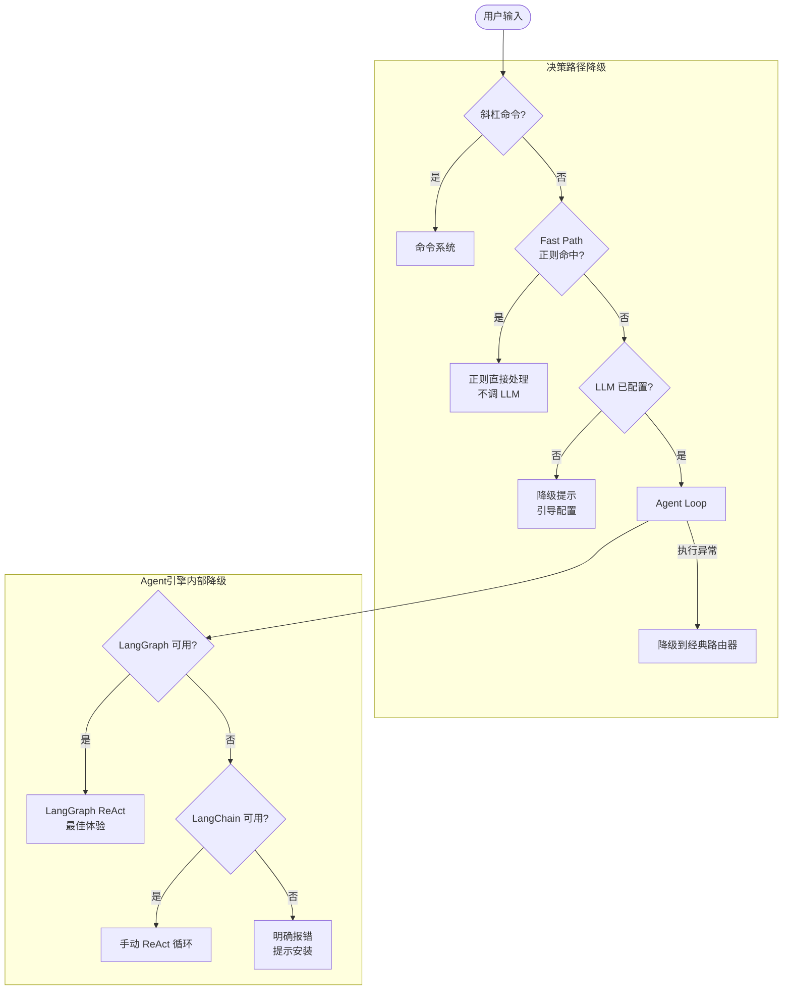
```mermaid
flowchart TB
    IN([用户输入]) --> P1
    subgraph 决策路径降级
        P1{斜杠命令?} -->|是| H1[命令系统]
        P1 -->|否| P2{Fast Path<br/>正则命中?}
        P2 -->|是| H2[正则直接处理<br/>不调 LLM]
        P2 -->|否| P3{LLM 已配置?}
        P3 -->|否| H3[降级提示<br/>引导配置]
        P3 -->|是| H4[Agent Loop]
        H4 -->|执行异常| H5[降级到经典路由器]
    end
    subgraph Agent引擎内部降级
        H4 --> E1{LangGraph 可用?}
        E1 -->|是| M1[LangGraph ReAct<br/>最佳体验]
        E1 -->|否| E2{LangChain 可用?}
        E2 -->|是| M2[手动 ReAct 循环]
        E2 -->|否| M3[明确报错<br/>提示安装]
    end
```

- **决策层降级**：斜杠命令 → Fast Path 正则 → Agent Loop → 经典路由器，每一层处理不了就交给下一层。
- **引擎层降级**：`AgentLoop._detect_mode()` 自动探测——优先 **LangGraph**（`create_react_agent`，体验最佳），没有就退到**手动 ReAct 循环**（`bind_tools` + 手动消息循环），再没有就明确报错提示安装。
- **NLU 层降级**：LLM 解析失败时，`LangChainEngine.parse()` 会回退到正则 Fast Path 再试一次。

> **价值**：即便没装 `langgraph`、没配 LLM、甚至 LLM API 挂了，Keeper 也不会"完全不可用"——总有一个保底路径。

#### 支柱二：双层安全管控（安全性）

LLM 可能生成任意命令，因此 Keeper 在**工具级**和**命令级**设了两道闸门。

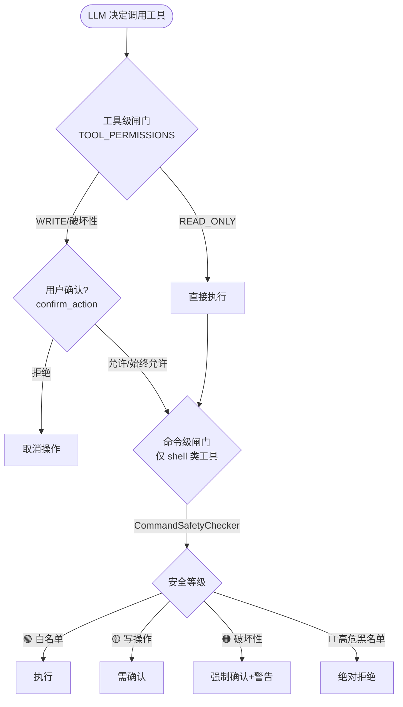
```mermaid
flowchart TB
    LLM([LLM 决定调用工具]) --> G1{工具级闸门<br/>TOOL_PERMISSIONS}
    G1 -->|READ_ONLY| RUN[直接执行]
    G1 -->|WRITE/破坏性| CONFIRM{用户确认?<br/>confirm_action}
    CONFIRM -->|拒绝| STOP[取消操作]
    CONFIRM -->|允许/始终允许| G2
    RUN --> G2{命令级闸门<br/>仅 shell 类工具}
    G2 -->|CommandSafetyChecker| CHK{安全等级}
    CHK -->|🟢 白名单| EXEC[执行]
    CHK -->|🟡 写操作| NEEDYES[需确认]
    CHK -->|🟠 破坏性| WARN[强制确认+警告]
    CHK -->|🔴 高危黑名单| BLOCK[绝对拒绝]
```

- **第一道（工具级）**：`safety.py` 的 `TOOL_PERMISSIONS` 表给每个工具标了安全等级。只读工具（如 `inspect_server`）自动放行；写工具（如 `manage_systemd_service`）执行前弹出 `confirm_action` 确认。
- **第二道（命令级）**：对会执行 shell 的工具（`run_bash`、`execute_shell_command`），`CommandSafetyChecker` 用正则把命令分成黑名单（`rm -rf`、`dd`、fork bomb 等→直接拒绝）、灰名单（`systemctl restart` 等→需确认）、破坏性（`docker prune` 等→强制确认）、白名单（`ps`、`df` 等→放行）。

> **价值**：即使 LLM "脑子一热"想删库，命令级黑名单也会在最后一刻拦下来。详见[第七章](#第七章-安全设计专题)。

#### 支柱三：自服务引导（易用性）

这是 Keeper 区别于普通脚本工具的"人性化"设计：**遇到问题不报错了事，而是引导用户解决。**

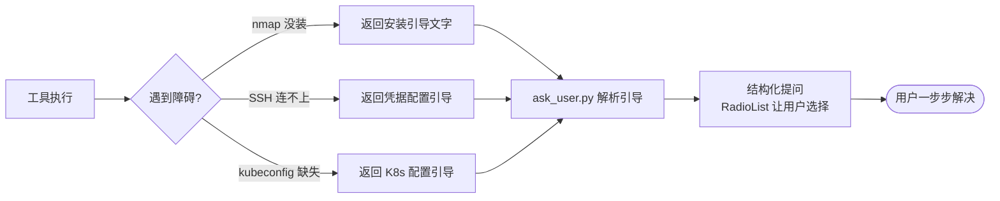
```mermaid
flowchart LR
    T[工具执行] --> Q{遇到障碍?}
    Q -->|nmap 没装| G1[返回安装引导文字]
    Q -->|SSH 连不上| G2[返回凭据配置引导]
    Q -->|kubeconfig 缺失| G3[返回 K8s 配置引导]
    G1 & G2 & G3 --> PARSE[ask_user.py 解析引导]
    PARSE --> ASK[结构化提问<br/>RadioList 让用户选择]
    ASK --> RESOLVE([用户一步步解决])
```

工具遇到"缺依赖/连不上/没配置"时，**返回的是一段引导文字而非异常**。`ask_user.py` 会把这段引导解析成结构化的提问（甚至弹出选项让用户选），由 LLM 在系统提示词里被告知"这是引导信息，请帮用户解决，不要直接放弃"（见 `loop.py` 系统提示中的"自主服务原则"）。

> **价值**：新手不会被一句 `command not found: nmap` 劝退，而是被一步步带着把环境配好。

### 3.4 技术栈一览

| 维度 | 选型 | 说明 |
| --- | --- | --- |
| 语言 | Python ≥ 3.9 | 运维生态友好 |
| Agent 框架 | LangGraph + LangChain | `create_react_agent` 提供 ReAct 能力 |
| LLM 接入 | langchain-openai / langchain-anthropic | 双 Provider：OpenAI 兼容 + Anthropic |
| CLI | Click + prompt-toolkit | 命令组 + 交互式 REPL（历史/补全） |
| API | FastAPI + Uvicorn | REST + WebSocket，自带 `/docs` |
| 系统监控 | psutil | CPU/内存/磁盘/进程，跨平台 |
| 容器编排 | kubernetes SDK / kubectl | K8s 巡检与操作 |
| 容器 | Docker SDK / CLI | 容器/镜像管理 |
| 远程 | paramiko / OpenSSH | SSH 远程巡检与执行 |
| 安全扫描 | Nmap | 端口/漏洞扫描 |
| 数据校验 | pydantic v2 | API 模型 + 工具参数 schema |
| 持久化 | SQLite + JSON + YAML | 巡检历史 / 记忆 / 配置 |
| 任务调度 | schedule | Cron 风格定时任务 |
| 通知 | 飞书 / 钉钉 / 企业微信 | Webhook 推送 |

> 依赖分组（见 `pyproject.toml`）：核心依赖默认安装；K8s（`kubernetes`）、API（`fastapi`、`uvicorn`）、开发（`pytest` 等）为可选 extras，按需 `pip install -e ".[k8s,api,dev]"`。


---

## 第四章 核心引擎详解：Hybrid Agent

本章深入"编排层"的四个核心角色：**HybridAgent（总调度）**、**AgentLoop（ReAct 引擎）**、**Fast Path（快速路径）**、**经典路由器（降级兜底）**。它们共同构成了 Keeper 的"大脑"。

### 4.1 HybridAgent：总调度官

`agent/hybrid.py` 的 `HybridAgent.process(user_input)` 是所有 Agent 模式请求的唯一入口。它像一个分诊台，决定每句话该走哪条路。

**处理顺序（源码逻辑）：**

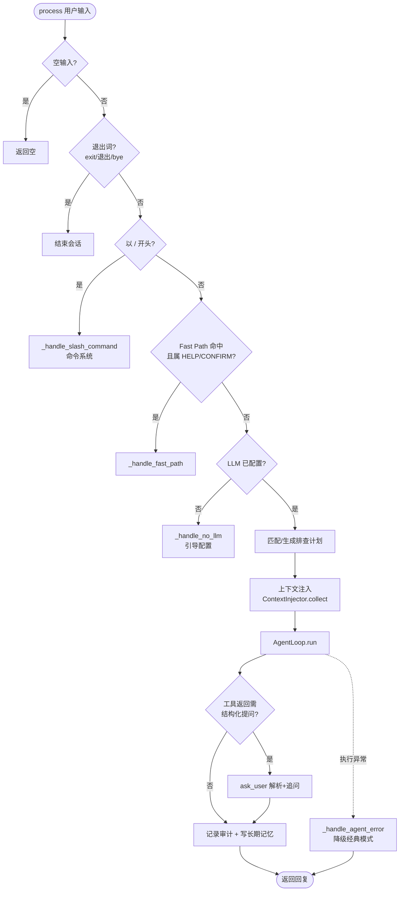
```mermaid
flowchart TB
    START([process 用户输入]) --> S0{空输入?}
    S0 -->|是| RET0[返回空]
    S0 -->|否| S1{退出词?<br/>exit/退出/bye}
    S1 -->|是| RET1[结束会话]
    S1 -->|否| S2{以 / 开头?}
    S2 -->|是| SLASH[_handle_slash_command<br/>命令系统]
    S2 -->|否| S3{Fast Path 命中<br/>且属 HELP/CONFIRM?}
    S3 -->|是| FAST[_handle_fast_path]
    S3 -->|否| S4{LLM 已配置?}
    S4 -->|否| NOLLM[_handle_no_llm<br/>引导配置]
    S4 -->|是| PLAN[匹配/生成排查计划]
    PLAN --> INJECT[上下文注入<br/>ContextInjector.collect]
    INJECT --> RUN[AgentLoop.run]
    RUN --> ASK{工具返回需<br/>结构化提问?}
    ASK -->|是| QFMT[ask_user 解析+追问]
    ASK -->|否| AUDIT
    QFMT --> AUDIT[记录审计 + 写长期记忆]
    AUDIT --> RET([返回回复])
    RUN -.执行异常.-> FALLBACK[_handle_agent_error<br/>降级经典模式]
    FALLBACK --> RET
```

**关键职责：**

1. **分流**：斜杠命令、Fast Path、Agent Loop 三条路径的入口判断。
2. **计划注入**：调用 `planner.match_plan_template()` 匹配 6 个排查模板；若没匹配但输入像复杂任务（含"为什么/排查/分析"），用 `generate_dynamic_plan()` 动态生成；把排查路线作为 `[排查路线: ...]` 拼到用户输入后，引导 LLM 按章法排查。
3. **上下文注入**：首轮注入主机状态 + 记忆摘要；后续轮按关键词注入相关历史记忆（见 [4.5](#45-上下文注入与记忆)）。
4. **结构化提问**：执行后检查工具结果，若包含"引导信息"，用 `ask_user_parser` 转成提问，必要时弹 `select_option` 让用户选。
5. **善后**：写审计日志（`AuditLogger.log_turn`）、写长期记忆（`AgentMemory.add`）、同步状态总线。
6. **兜底**：`AgentLoop.run` 抛异常时，`_handle_agent_error` 尝试用经典路由器再跑一遍。

**延迟初始化**：`agent_loop` 是 `@property` 懒加载——Fast Path 命中时根本不会创建 LLM，节省约 1.4 秒启动开销。

### 4.2 AgentLoop：ReAct 推理引擎

`agent/loop.py` 的 `AgentLoop` 是真正干活的引擎，实现了 **ReAct（Reasoning + Acting）** 范式：

> 想（LLM 决定调什么工具）→ 做（执行工具）→ 看（把结果喂回 LLM）→ 再想……循环直到 LLM 给出最终答案。

**三个关键常量（防失控）：**

| 常量 | 值 | 含义 |
| --- | --- | --- |
| `MAX_LOOPS` | 10 | 最多循环 10 步，防止死循环 |
| `MAX_OUTPUT_LEN` | 2000 | 单个工具输出超 2000 字符触发压缩 |
| `MAX_HISTORY_TURNS` | 5 | 上下文最多保留最近 5 轮对话 |

**两种工具集模式 × 两种权限模式：**

- `tool_mode`：`free`（仅 5 个自由工具）/ `routed`（仅 23 个运维工具）/ `all`（全部，HybridAgent 默认）。
- `permission_mode`：`allow`（默认，全部放行）/ `read_only`（用 `filter_tools_by_safety` 只保留只读工具）。

**两种执行模式（自动降级）：**

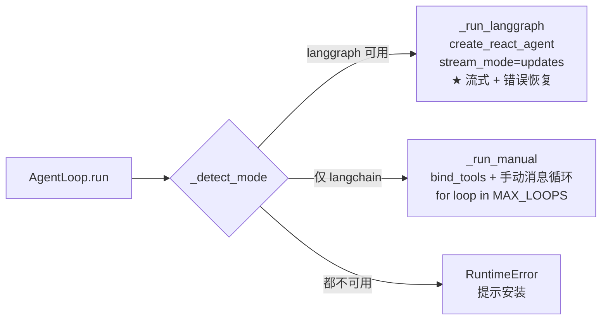
```mermaid
flowchart LR
    RUN[AgentLoop.run] --> DET{_detect_mode}
    DET -->|langgraph 可用| LG["_run_langgraph<br/>create_react_agent<br/>stream_mode=updates<br/>★ 流式 + 错误恢复"]
    DET -->|仅 langchain| MAN["_run_manual<br/>bind_tools + 手动消息循环<br/>for loop in MAX_LOOPS"]
    DET -->|都不可用| ERR[RuntimeError<br/>提示安装]
```

- **LangGraph 模式**（`_run_langgraph`）：用 `agent.stream(..., stream_mode="updates")` 逐步拿到"agent 节点（LLM 决策）"和"tools 节点（工具结果）"的更新，实时 `_emit` 事件给前端（⏳→✓）。流式异常时自动降级为阻塞式 `agent.invoke`。
- **手动模式**（`_run_manual`）：自己维护 `messages` 列表，循环最多 `MAX_LOOPS` 次：调 LLM → 若有 `tool_calls` 则执行并把 `ToolMessage` 喂回 → 直到无工具调用（得到最终答案）。

**两处贴心的健壮性设计：**
- **重复调用检测**：同一工具连续调用 ≥ 3 次时发 `warning`，提示 LLM 换工具（防止 LLM 钻牛角尖）。
- **TTL 失效重建**：若上下文缓存过期（`context_injector.is_stale()`），下次 `run` 会重建 agent 以刷新系统提示中的环境上下文。

### 4.3 工具执行与安全确认

无论哪种执行模式，工具调用都会经过安全闸门。以手动模式 `_run_manual` 为例：

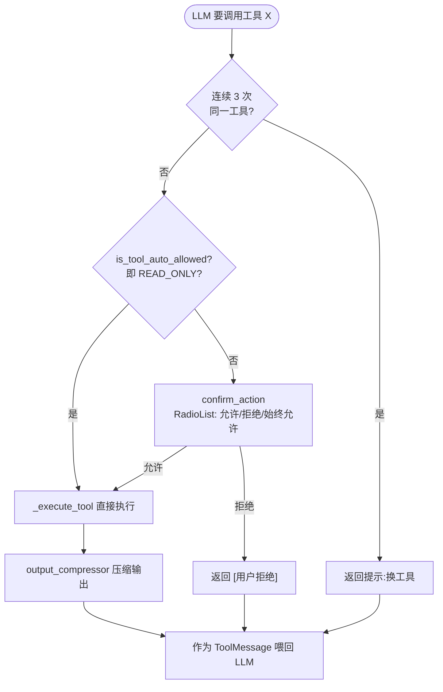
```mermaid
flowchart TB
    TC([LLM 要调用工具 X]) --> DUP{连续 3 次<br/>同一工具?}
    DUP -->|是| W[返回提示:换工具]
    DUP -->|否| AUTO{is_tool_auto_allowed?<br/>即 READ_ONLY?}
    AUTO -->|是| EXEC[_execute_tool 直接执行]
    AUTO -->|否| CONF["confirm_action<br/>RadioList: 允许/拒绝/始终允许"]
    CONF -->|拒绝| DENY["返回 [用户拒绝]"]
    CONF -->|允许| EXEC
    EXEC --> COMP[output_compressor 压缩输出]
    COMP --> FEED[作为 ToolMessage 喂回 LLM]
    DENY --> FEED
    W --> FEED
```

- LangGraph 模式则通过 `_wrap_tools_with_confirmation` 把非只读工具包一层确认逻辑（`_make_wrapped_tool`），效果等价。
- `_execute_tool` 统一负责：执行 → 用 `output_compressor.compress` 压缩超长输出 → 发 `tool_result` 事件。

### 4.4 Fast Path：不动用 AI 的快速路径

`nlu/langchain_engine.py` 顶部的 `_FAST_PATTERNS` 是一组（约 26 条）预编译正则。`_try_fast_match()` 在 LLM 之前先跑一遍：

- **命中即返回**：像"帮助""yes/确认""检查本机""K8s 巡检""ping""清理 docker"等高频确定性指令，正则直接识别意图并抽取实体（IP、端口），**完全跳过 LLM**，毫秒级响应。
- **HybridAgent 只让 `HELP` 和 `CONFIRM` 走 Fast Path 直接处理**（`FAST_PATH_INTENTS`）；其余命中只是作为降级兜底时的意图线索。
- **双重价值**：① 省钱省时（高频简单指令不烧 token）；② LLM 不可用时的降级依据。

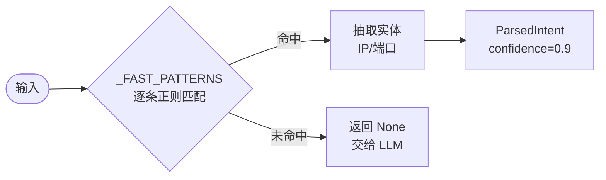
```mermaid
flowchart LR
    IN([输入]) --> RE{_FAST_PATTERNS<br/>逐条正则匹配}
    RE -->|命中| EX[抽取实体<br/>IP/端口] --> PI[ParsedIntent<br/>confidence=0.9]
    RE -->|未命中| NONE[返回 None<br/>交给 LLM]
```

### 4.5 上下文注入与记忆

为了让 LLM "开口前就知道该知道的事"，`context_injector.py` 在 `AgentLoop` 构建系统提示时注入三类上下文：

| 类别 | 内容 | 来源 |
| --- | --- | --- |
| **主机上下文** | hostname、OS、uptime、上次巡检的 CPU/内存/磁盘 | `socket`、`uname`、`uptime`、巡检历史 SQLite |
| **任务上下文** | 最近操作过的主机、最近用过的工具 | 巡检历史、审计日志 |
| **记忆摘要** | 跨会话的历史操作回顾 | `AgentMemory`（JSON） |

- **5 分钟 TTL 缓存**：`ContextInjector` 短时间内不重复采集，避免每轮都跑 `uname`/`uptime`。
- **记忆策略**：首轮注入最近 3 条记忆摘要；后续轮按当前输入关键词匹配相关记忆（`AgentMemory.get_context_for_prompt`）。
- **长期记忆**：`agent/memory.py` 持久化到 `~/.keeper/agent_memory.json`，最多 100 条，每条含时间、用户输入、用过的工具、结论摘要、主机、分类。

### 4.6 输出压缩：让上下文"不爆窗口"

工具输出可能巨大（一个日志文件几万行）。`compressor.py` 的四级压缩管线遵循"能局部处理就不全局摘要，尽量延后信息损失"：

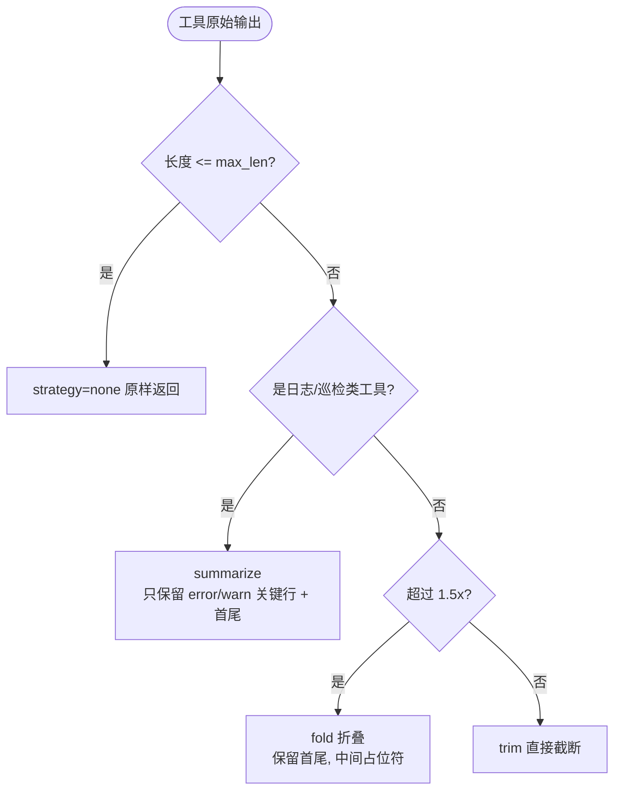
```mermaid
flowchart TB
    O([工具原始输出]) --> T1{长度 <= max_len?}
    T1 -->|是| NONE[strategy=none 原样返回]
    T1 -->|否| T2{是日志/巡检类工具?}
    T2 -->|是| SUM["summarize<br/>只保留 error/warn 关键行 + 首尾"]
    T2 -->|否| T3{超过 1.5x?}
    T3 -->|是| FOLD["fold 折叠<br/>保留首尾, 中间占位符"]
    T3 -->|否| TRIM["trim 直接截断"]
```

阈值：裁剪 3000 / 摘要 1500 / 折叠 800 / 极限统计 400 字符。另有 `compress_for_history` 在写入对话历史时进一步压缩到 500 字符以内。

### 4.7 经典路由器：另一套"大脑"

`core/agent.py` 的 `Agent` 是 v1.0 时代的实现，现在作为**降级兜底**和 `--classic` 模式保留。它与 Agent 模式的本质区别在于决策方式：

| 维度 | Agent 模式（`agent/`） | 经典模式（`core/`） |
| --- | --- | --- |
| 决策方式 | LLM 自主决定调哪些工具、调几次（多步） | NLU 解析出**单个意图** → 查 handler 映射表 → 单步执行 |
| 灵活性 | 高，能组合工具、自我纠错 | 低，一句话对应一个固定处理器 |
| 可预测性 | 较低（LLM 决定） | 高（确定性路由） |
| 定时任务 | 暂未集成（见第十三章） | `__init__` 即启动 `TaskScheduler` |
| 自动通知 | 由 HybridAgent 善后 | `_maybe_notify` 巡检后自动推飞书 |

经典模式流程：`process()` → `nlu.parse()` 拿到 `ParsedIntent` → 非任务直接返回 `direct_response` → 是任务则 `_dispatch()` 查 `handlers` 映射表（`INSPECT→handle_inspect` 等 20 个）→ 执行 → 审计 → 自动通知。它还维护 `PendingTask` 处理"安装/扫描/K8s 操作/修复"等需要二次确认的任务。

### 4.8 四个角色如何协作（总览）

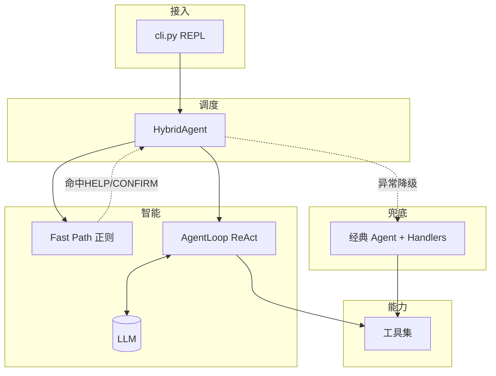
```mermaid
flowchart TB
    subgraph 接入
        CLI[cli.py REPL]
    end
    subgraph 调度
        HY[HybridAgent]
    end
    subgraph 智能
        FP[Fast Path 正则]
        AL[AgentLoop ReAct]
        LLM[(LLM)]
    end
    subgraph 兜底
        CL[经典 Agent + Handlers]
    end
    subgraph 能力
        TOOLS[工具集]
    end
    CLI --> HY
    HY --> FP
    HY --> AL
    AL <--> LLM
    AL --> TOOLS
    HY -. 异常降级 .-> CL
    CL --> TOOLS
    FP -. 命中HELP/CONFIRM .-> HY
```


---

## 第五章 关键流程时序图

本章用时序图把"一句话从输入到结果"的全过程拆开给你看。每张图都对应真实源码路径，读完你就能在脑子里"放电影"。

### 5.1 启动流程（`keeper` 命令）

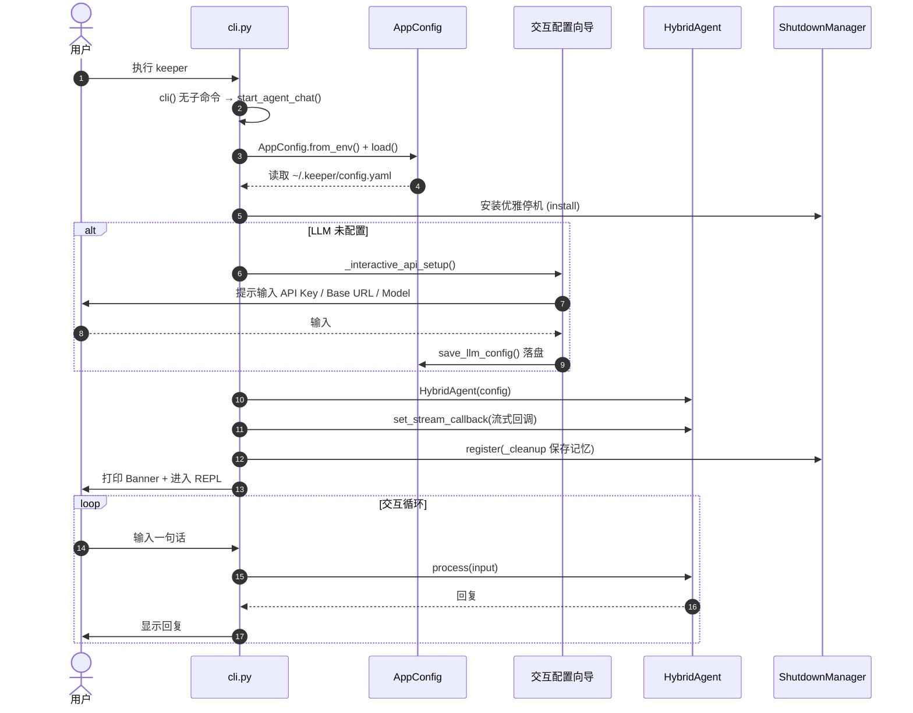
```mermaid
sequenceDiagram
    autonumber
    actor User as 用户
    participant CLI as cli.py
    participant Cfg as AppConfig
    participant Setup as 交互配置向导
    participant Hyb as HybridAgent
    participant SD as ShutdownManager

    User->>CLI: 执行 keeper
    CLI->>CLI: cli() 无子命令 → start_agent_chat()
    CLI->>Cfg: AppConfig.from_env() + load()
    Cfg-->>CLI: 读取 ~/.keeper/config.yaml
    CLI->>SD: 安装优雅停机 (install)
    alt LLM 未配置
        CLI->>Setup: _interactive_api_setup()
        Setup->>User: 提示输入 API Key / Base URL / Model
        User-->>Setup: 输入
        Setup->>Cfg: save_llm_config() 落盘
    end
    CLI->>Hyb: HybridAgent(config)
    CLI->>Hyb: set_stream_callback(流式回调)
    CLI->>SD: register(_cleanup 保存记忆)
    CLI->>User: 打印 Banner + 进入 REPL
    loop 交互循环
        User->>CLI: 输入一句话
        CLI->>Hyb: process(input)
        Hyb-->>CLI: 回复
        CLI->>User: 显示回复
    end
```

要点：配置懒加载、未配置则交互引导、注册优雅停机（Ctrl+C 时保存未持久化的记忆）。

### 5.2 ★ Agent 模式一次完整对话（核心流程）

这是最重要的一张图——以"分析为什么 CPU 高"为例，展示 LLM 多步推理的全过程。

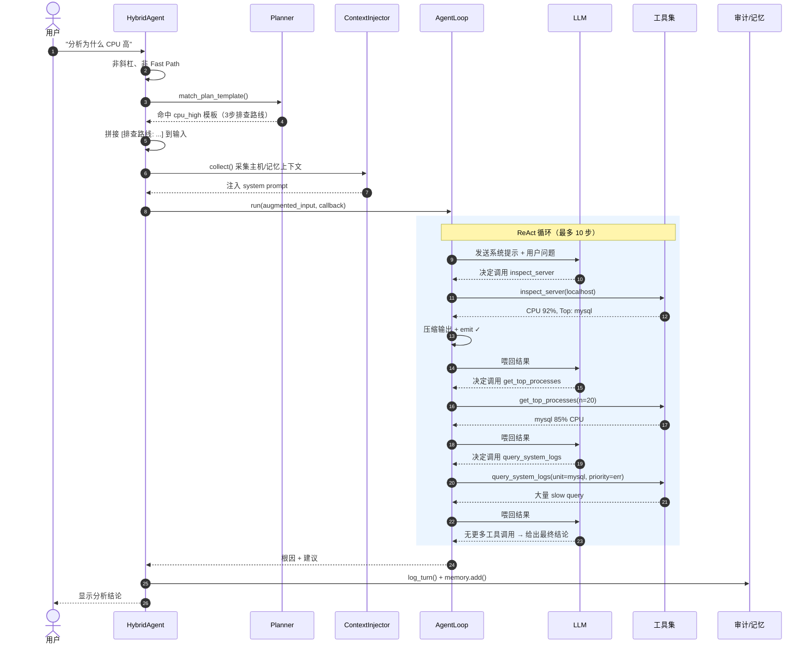
```mermaid
sequenceDiagram
    autonumber
    actor U as 用户
    participant H as HybridAgent
    participant P as Planner
    participant CI as ContextInjector
    participant L as AgentLoop
    participant LLM as LLM
    participant T as 工具集
    participant A as 审计/记忆

    U->>H: "分析为什么 CPU 高"
    H->>H: 非斜杠、非 Fast Path
    H->>P: match_plan_template()
    P-->>H: 命中 cpu_high 模板（3步排查路线）
    H->>H: 拼接 [排查路线: ...] 到输入
    H->>CI: collect() 采集主机/记忆上下文
    CI-->>H: 注入 system prompt
    H->>L: run(augmented_input, callback)

    rect rgb(235,245,255)
    note over L,T: ReAct 循环（最多 10 步）
    L->>LLM: 发送系统提示 + 用户问题
    LLM-->>L: 决定调用 inspect_server
    L->>T: inspect_server(localhost)
    T-->>L: CPU 92%, Top: mysql
    L->>L: 压缩输出 + emit ✓
    L->>LLM: 喂回结果
    LLM-->>L: 决定调用 get_top_processes
    L->>T: get_top_processes(n=20)
    T-->>L: mysql 85% CPU
    L->>LLM: 喂回结果
    LLM-->>L: 决定调用 query_system_logs
    L->>T: query_system_logs(unit=mysql, priority=err)
    T-->>L: 大量 slow query
    L->>LLM: 喂回结果
    LLM-->>L: 无更多工具调用 → 给出最终结论
    end

    L-->>H: 根因 + 建议
    H->>A: log_turn() + memory.add()
    H-->>U: 显示分析结论
```

观察重点：**用户只说一句话，LLM 自主决定了三次工具调用**，每次都根据上一步结果决定下一步——这就是 Agent 的核心价值。

### 5.3 Fast Path 快速路径（不烧 token）

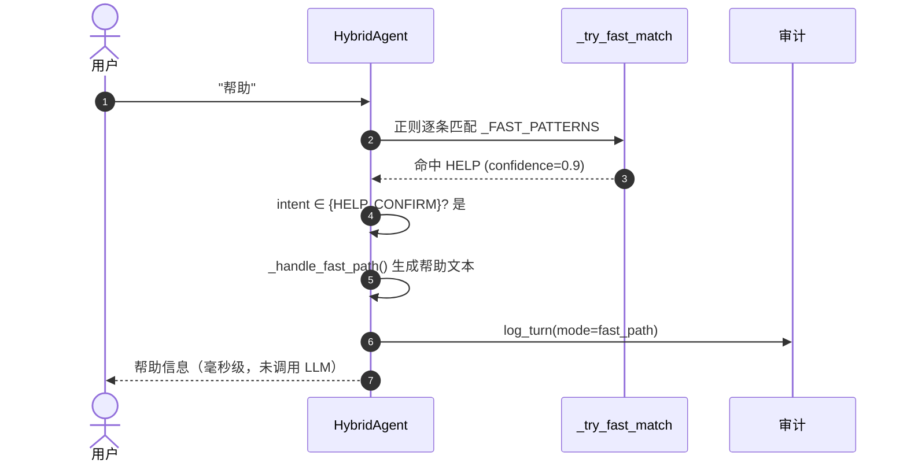
```mermaid
sequenceDiagram
    autonumber
    actor U as 用户
    participant H as HybridAgent
    participant F as _try_fast_match
    participant A as 审计

    U->>H: "帮助"
    H->>F: 正则逐条匹配 _FAST_PATTERNS
    F-->>H: 命中 HELP (confidence=0.9)
    H->>H: intent ∈ {HELP, CONFIRM}?  是
    H->>H: _handle_fast_path() 生成帮助文本
    H->>A: log_turn(mode=fast_path)
    H-->>U: 帮助信息（毫秒级，未调用 LLM）
```

### 5.4 工具调用 + 安全确认（写操作）

以"重启 nginx 服务"为例，展示安全闸门如何介入。

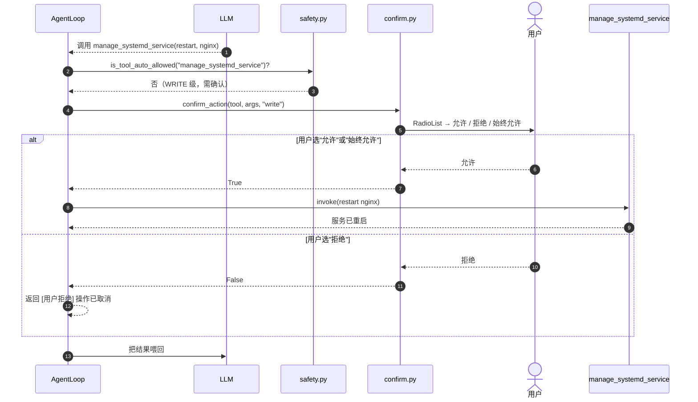
```mermaid
sequenceDiagram
    autonumber
    participant L as AgentLoop
    participant LLM as LLM
    participant S as safety.py
    participant C as confirm.py
    actor U as 用户
    participant T as manage_systemd_service

    LLM-->>L: 调用 manage_systemd_service(restart, nginx)
    L->>S: is_tool_auto_allowed("manage_systemd_service")?
    S-->>L: 否（WRITE 级，需确认）
    L->>C: confirm_action(tool, args, "write")
    C->>U: RadioList → 允许 / 拒绝 / 始终允许
    alt 用户选"允许"或"始终允许"
        U-->>C: 允许
        C-->>L: True
        L->>T: invoke(restart nginx)
        T-->>L: 服务已重启
    else 用户选"拒绝"
        U-->>C: 拒绝
        C-->>L: False
        L-->>L: 返回 [用户拒绝] 操作已取消
    end
    L->>LLM: 把结果喂回
```

补充：若是 `run_bash`/`execute_shell_command`，命令本身还会先过 `CommandSafetyChecker`——黑名单命令（如 `rm -rf`）在工具内部就被直接拒绝，连确认框都不弹。非 TTY 环境下 `confirm_action` 自动降级：WRITE 放行、DESTRUCTIVE 拒绝。

### 5.5 LangGraph 流式执行内部

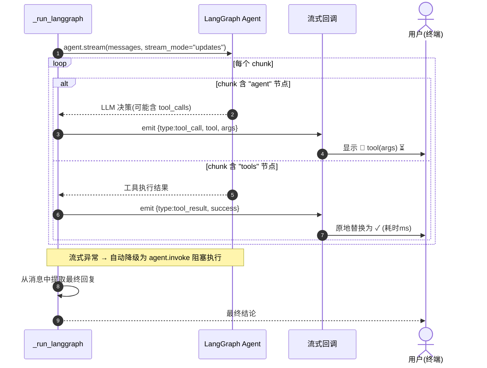
```mermaid
sequenceDiagram
    autonumber
    participant L as _run_langgraph
    participant G as LangGraph Agent
    participant CB as 流式回调
    actor U as 用户(终端)

    L->>G: agent.stream(messages, stream_mode="updates")
    loop 每个 chunk
        alt chunk 含 "agent" 节点
            G-->>L: LLM 决策(可能含 tool_calls)
            L->>CB: emit {type:tool_call, tool, args}
            CB->>U: 显示 🔧 tool(args) ⏳
        else chunk 含 "tools" 节点
            G-->>L: 工具执行结果
            L->>CB: emit {type:tool_result, success}
            CB->>U: 原地替换为 ✓ (耗时ms)
        end
    end
    Note over L,G: 流式异常 → 自动降级为 agent.invoke 阻塞执行
    L->>L: 从消息中提取最终回复
    L-->>U: 最终结论
```

亮点：工具调用先显示 ⏳，完成后用 ANSI 光标控制**原地替换**为 ✓——这正是 CLI 里那种"实时进度"的观感来源（`cli.py` 的 `_create_stream_callback`）。

### 5.6 经典模式降级流程

当 Agent Loop 抛异常（如 LLM API 故障）时：

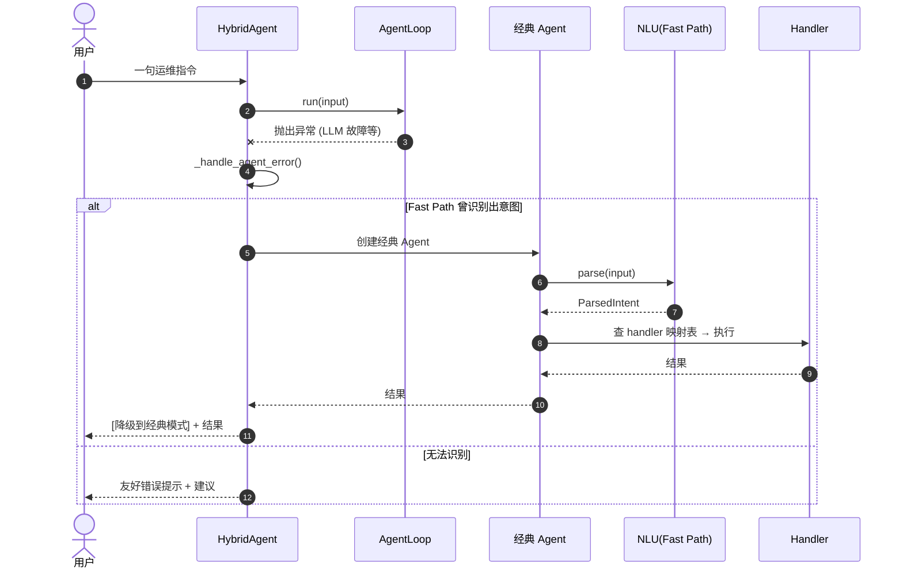
```mermaid
sequenceDiagram
    autonumber
    actor U as 用户
    participant H as HybridAgent
    participant L as AgentLoop
    participant CA as 经典 Agent
    participant NLU as NLU(Fast Path)
    participant HD as Handler

    U->>H: 一句运维指令
    H->>L: run(input)
    L--xH: 抛出异常 (LLM 故障等)
    H->>H: _handle_agent_error()
    alt Fast Path 曾识别出意图
        H->>CA: 创建经典 Agent
        CA->>NLU: parse(input)
        NLU-->>CA: ParsedIntent
        CA->>HD: 查 handler 映射表 → 执行
        HD-->>CA: 结果
        CA-->>H: 结果
        H-->>U: [降级到经典模式] + 结果
    else 无法识别
        H-->>U: 友好错误提示 + 建议
    end
```

### 5.7 Runbook 安装与执行

**安装（把 SOP 变成可调度的"技能"）：**

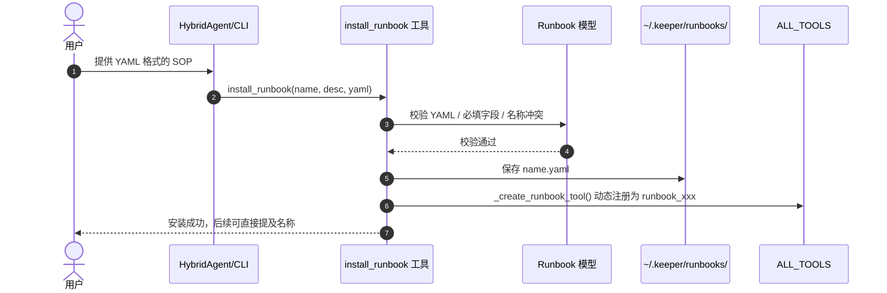
```mermaid
sequenceDiagram
    autonumber
    actor U as 用户
    participant H as HybridAgent/CLI
    participant IR as install_runbook 工具
    participant RB as Runbook 模型
    participant FS as ~/.keeper/runbooks/
    participant REG as ALL_TOOLS

    U->>H: 提供 YAML 格式的 SOP
    H->>IR: install_runbook(name, desc, yaml)
    IR->>RB: 校验 YAML / 必填字段 / 名称冲突
    RB-->>IR: 校验通过
    IR->>FS: 保存 name.yaml
    IR->>REG: _create_runbook_tool() 动态注册为 runbook_xxx
    IR-->>U: 安装成功，后续可直接提及名称
```

**执行（LLM 自主调度或手动触发）：**

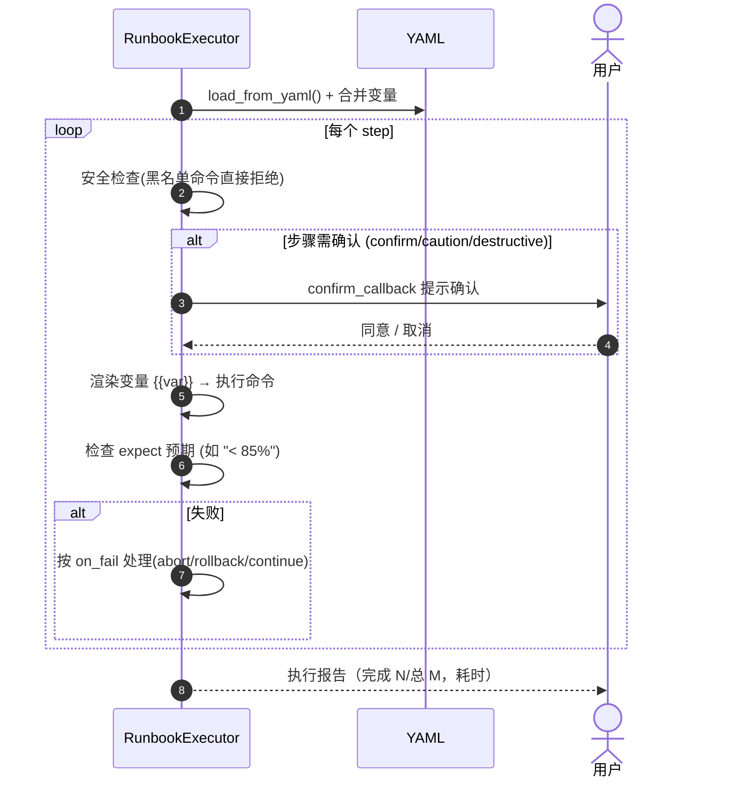
```mermaid
sequenceDiagram
    autonumber
    participant EX as RunbookExecutor
    participant Y as YAML
    actor U as 用户

    EX->>Y: load_from_yaml() + 合并变量
    loop 每个 step
        EX->>EX: 安全检查(黑名单命令直接拒绝)
        alt 步骤需确认 (confirm/caution/destructive)
            EX->>U: confirm_callback 提示确认
            U-->>EX: 同意 / 取消
        end
        EX->>EX: 渲染变量 {{var}} → 执行命令
        EX->>EX: 检查 expect 预期 (如 "< 85%")
        alt 失败
            EX->>EX: 按 on_fail 处理(abort/rollback/continue)
        end
    end
    EX-->>U: 执行报告（完成 N/总 M，耗时）
```

### 5.8 上下文注入流程（5 分钟缓存）

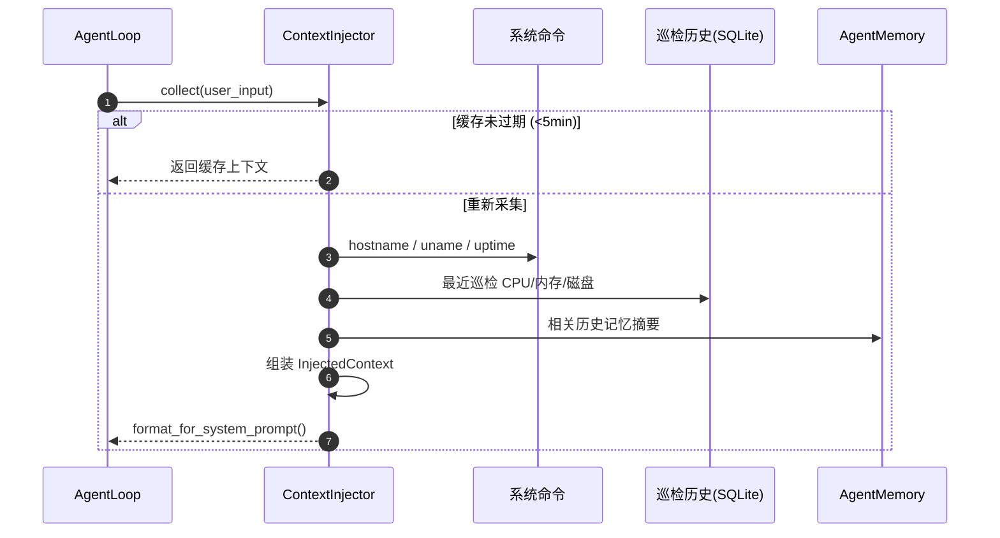
```mermaid
sequenceDiagram
    autonumber
    participant L as AgentLoop
    participant CI as ContextInjector
    participant SYS as 系统命令
    participant HIST as 巡检历史(SQLite)
    participant MEM as AgentMemory

    L->>CI: collect(user_input)
    alt 缓存未过期 (<5min)
        CI-->>L: 返回缓存上下文
    else 重新采集
        CI->>SYS: hostname / uname / uptime
        CI->>HIST: 最近巡检 CPU/内存/磁盘
        CI->>MEM: 相关历史记忆摘要
        CI->>CI: 组装 InjectedContext
        CI-->>L: format_for_system_prompt()
    end
```

### 5.9 HTTP API / WebSocket 流式

```mermaid
sequenceDiagram
    autonumber
    actor C as 客户端
    participant MW as Rate Limit 中间件
    participant Auth as Bearer 鉴权
    participant WS as /ws/query
    participant H as HybridAgent
    participant L as AgentLoop

    C->>WS: 建立 WebSocket 连接
    WS-->>C: accept
    C->>WS: {type:query, query:"检查本机", token}
    WS->>Auth: 校验 token
    Auth-->>WS: 通过
    WS->>H: run_in_executor(process) 线程池执行
    H->>L: run(query, sync_callback)
    L-->>WS: 缓冲 tool_call / tool_result 事件
    WS-->>C: 逐条推送事件
    L-->>H: 最终回复
    H-->>WS: response
    WS-->>C: {type:done, response, tools_used, duration_ms}
```

REST 接口（`POST /api/v1/query`）则是同步阻塞版：经 Rate Limiter（默认 60 次/分钟/IP）和 Bearer Token 鉴权后，调用 `HybridAgent.process` 或经典 `Agent`，返回 `QueryResponse`。

### 5.10 定时任务（经典模式）

```mermaid
sequenceDiagram
    autonumber
    actor U as 用户
    participant CA as 经典 Agent
    participant SCH as TaskScheduler
    participant CB as _execute_scheduled_task

    U->>CA: "每30分钟检查一次"
    CA->>SCH: add_task(cron, desc, type)
    SCH-->>CA: 任务已登记
    Note over SCH: 后台线程按 cron 触发
    SCH->>CB: 到点回调
    CB->>CB: 按 task_type 执行(inspect/batch/k8s/network)
    CB-->>SCH: 执行结果(可推送通知)
```

> ⚠️ 注意：`TaskScheduler` 目前在**经典 `Agent.__init__`** 中启动，Agent 模式（`HybridAgent`）尚未集成定时任务——这是一个已知的功能缺口（见第十三章）。

### 5.11 服务器巡检的"副作用链"

`inspect_server` 工具不只是返回报告，它在一次调用里串联了多个能力（这是工具层的一个精巧设计）：

```mermaid
flowchart LR
    I[inspect_server] --> COLLECT[psutil 采集<br/>CPU/内存/磁盘/进程]
    COLLECT --> REPORT[format_status_report]
    COLLECT --> H[(写巡检历史<br/>SQLite)]
    COLLECT --> ALERT[AlertEngine 告警检查]
    COLLECT --> CMP[与上次巡检对比]
    ALERT --> REPORT2[追加告警到报告]
    CMP --> REPORT3[追加对比到报告]
    REPORT2 & REPORT3 --> OUT([返回完整报告])
```

一次巡检自动完成：采集 → 写历史（供容量预测/对比）→ 触发告警 → 与上次对比，全部追加进同一份报告。


---

## 第六章 模块逐一详解

本章对每个核心模块给出"职责 / 关键类与函数 / 设计优缺点"。表格化呈现，便于按需查阅。

### 6.1 接入层

#### `cli.py` — CLI 入口

- **职责**：基于 Click 定义命令组，基于 prompt_toolkit 实现交互式 REPL；承载所有 `keeper xxx` 子命令。
- **关键内容**：
  - 顶层 `cli()` 命令组；无子命令时启动 `start_agent_chat()`（Agent 模式）或 `start_chat()`（`--classic`）。
  - 子命令族：`run`、`exec`、`status`、`logs`、`init`、`config`（set/show/clear）、`k8s`（inspect/logs/events/exec/scale/restart）、`docker`（ls/stats/images/prune）、`network`（ping/port/dns/http）、`schedule`、`fix`、`cert`、`runbook`、`notify`。
  - `_create_stream_callback()`：把 Agent 事件渲染成终端的 ⏳→✓ 实时进度。
  - `_interactive_api_setup()`：首次启动的交互式配置向导。
- **优点**：命令组织清晰；REPL 有历史/自动补全；流式回调体验好；K8s/Docker 等子命令对 SDK 缺失有友好降级提示。
- **缺点**：文件较大（约 1500 行），CLI 与业务耦合处不少，单测困难（这也是全局覆盖率偏低的主因之一）。

#### `api/server.py` — HTTP API 服务

- **职责**：FastAPI 实现的 REST + WebSocket 服务，供外部系统集成。
- **关键内容**：Pydantic 请求/响应模型；`RateLimiter`（滑动窗口，默认 60/分钟/IP）；Bearer Token 鉴权（`KEEPER_API_TOKEN`）；CORS；丰富的端点（见 [9.4 节](#94-rest--websocket-api-端点)）；批量接口走 `utils/async_utils` 异步并发。
- **优点**：接口完善、自带 `/docs`、有鉴权与限流、WebSocket 支持流式、批量操作异步化。
- **缺点**：WebSocket 因 `HybridAgent.process` 是同步的，采用"线程池执行 + 事件缓冲后补发"的折中，并非真正逐字节流式；全局单例 `app.state.agent` 在并发下共享状态需留意。

### 6.2 编排层

| 模块 | 职责 | 关键类/函数 | 优点 | 缺点/取舍 |
| --- | --- | --- | --- | --- |
| `agent/hybrid.py` | 总调度 | `HybridAgent.process`、`_handle_slash_command`、`_handle_agent_error` | 分流清晰、懒加载省启动、善后完整 | 计划注入用关键词，覆盖有限 |
| `agent/loop.py` | ReAct 引擎 | `AgentLoop`、`_run_langgraph`、`_run_manual`、`_wrap_tools_with_confirmation` | 双模式降级、流式、重复检测、确认包装 | 系统提示词较长（token 成本）；手动模式无并行工具 |
| `core/agent.py` | 经典路由 | `Agent.process`、`_dispatch`、`PendingTask` | 确定性强、可预测、内置调度 | 单步单意图、不灵活 |
| `nlu/langchain_engine.py` | 语义理解 | `_try_fast_match`、`LangChainEngine.parse` | Fast Path 省钱、LLM 兜底降级 | 巨型系统提示词维护成本高 |
| `nlu/base.py` | 意图定义 | `IntentType`、`ParsedIntent` | 结构清晰 | 意图枚举较多，需同步维护 |

### 6.3 能力层（Agent 工具体系）

| 模块 | 职责 | 关键内容 | 说明 |
| --- | --- | --- | --- |
| `agent/tools_registry.py` | 工具注册中心 | `@tool` 装饰 23 个运维工具；`ToolMeta`（安全级/只读/标签）；`filter_tools_by_safety/tags`；`install_runbook`；动态 Runbook 注册；`todo_write` | LLM 据 docstring 自主选择工具；`inspect_server` 串联历史/告警/对比 |
| `agent/free_tools.py` | 自由工具 | `run_bash`/`read_file`/`write_file`/`list_directory`/`search_files` | 通用能力，类 Claude Code；读直放、写需确认、危险拦截 |
| `core/handlers/` | 经典处理器 | `handle_inspect`/`handle_k8s_*`/`handle_docker`/`handle_network`/`handle_scan` 等 11 个 | 经典模式下意图→处理器的映射实现 |
| `runbook/` | 运维手册引擎 | `RunbookExecutor`、`Runbook`/`RunbookStep` 模型、`StepSafety`/`OnFailAction` | YAML SOP；变量渲染、确认、预期检查、失败回滚 |

> **`@tool` 兼容层的巧思**：`tools_registry.py` 在 langchain 不可用时提供 fallback `tool` 装饰器，给函数挂上 `.name`/`.description`/`.invoke`，保证工具函数在无 LLM 框架时仍可被调用——又一处"降级"体现。

### 6.4 底层工具集（`tools/`）

这些是真正"动手"的实现，每个模块遵循一致范式：`XxxTools` 类（静态方法）+ `dataclass` 结果对象 + `format_xxx()` 报告函数。

| 模块 | 核心类 | 能力 |
| --- | --- | --- |
| `server.py` | `ServerTools` | 服务器巡检（psutil）、Top 进程、批量巡检、健康评分 |
| `k8s/client.py` | `K8sClient` | 连接 + 自动探测 kubeconfig（k3s/kubeadm 等路径） |
| `k8s/inspector.py` | `K8sInspector` | 集群全面巡检：节点/Pod/工作负载/存储/服务/事件/Ingress/配额，含健康评分 |
| `k8s/ops.py` | `K8sOps` | 扩缩容、滚动重启、回滚、Pod 内执行 |
| `docker_tools.py` | `DockerTools` | 容器/镜像列表、统计、日志、清理 |
| `network.py` | `NetworkTools` | Ping、端口、DNS、HTTP 健康检查 |
| `scanner.py` | `ScannerTools` | Nmap 端口/漏洞扫描（未装时给安装引导） |
| `cert_monitor.py` | `CertMonitor` | 本地证书扫描 + 域名 SSL 检查 + 到期预警 |
| `ssh.py` | `SSHTools` | SSH 远程执行（paramiko），从 `/etc/hosts` 取主机 |
| `rca.py` | `RCAEngine` | 根因分析：采集数据 + 生成诊断/对比提示词 |
| `fixer.py` | `FixSuggester` | 规则化修复建议（含 `SafetyLevel` 分级）、执行、效果验证 |
| `alert.py` | `AlertEngine` | 基于巡检结果的阈值告警 |
| `capacity.py` | `CapacityPredictor` | 基于历史的线性回归容量预测 |
| `comparator.py` | `InspectionComparator` | 巡检历史对比（指标差异、趋势） |
| `scheduler.py` | `TaskScheduler` | Cron 风格定时任务管理 |
| `reporter.py` | `ReportExporter` | JSON/HTML 报告导出 |
| `log_analyzer.py` | `LogAnalyzer` | 日志错误聚合 + 异常模式检测 |
| `snapshot.py` | `SnapshotManager` | 修复前状态快照（便于回滚参考） |
| `timeline.py` | `TimelineBuilder` | 事件时间线构建（RCA 增强） |

- **优点**：范式统一、职责单一、易组合；对外部依赖缺失（nmap/SDK）有引导式降级。
- **缺点**：纯系统调用部分难以单测（覆盖率低）；少量能力与 Agent 工具语义重叠（如修复建议在经典/Agent 两处都有路径）。

### 6.5 基础设施层

| 模块 | 职责 | 关键点 | 优缺点 |
| --- | --- | --- | --- |
| `agent/safety.py` | 安全控制 | `CommandSafetyChecker`（黑/灰/破坏/白名单正则）+ `TOOL_PERMISSIONS` 表 | 优：双层防护、规则透明；缺：正则可能误判/绕过，依赖维护 |
| `agent/confirm.py` | 交互确认 | prompt_toolkit `RadioList`；`confirm_action`/`select_option`/`select_or_input`；会话级"始终允许"缓存 | 优：体验好、非 TTY 自动降级；缺：依赖 TTY，自动化场景需注意默认策略 |
| `agent/planner.py` | 计划生成 | 6 个模板 + `generate_dynamic_plan` 关键词拼装 | 优：给 LLM 排查章法；缺：关键词匹配覆盖有限 |
| `agent/context_injector.py` | 上下文注入 | 主机/任务/记忆三类 + 5 分钟 TTL | 优：让 LLM 先知环境；缺：TTL 内多轮可能读到旧数据 |
| `agent/compressor.py` | 输出压缩 | 四级管线 trim/summarize/fold/stats | 优：防爆上下文、保留关键行；缺：摘要可能丢信息 |
| `agent/state.py` | 状态总线 | `AgentStateStore` + `TodoList`（TodoWrite 工具） | 优：集中状态、可挂 hook；缺：与各处局部状态并存，未完全收口 |
| `agent/commands.py` | 斜杠命令 | `/clear` `/history` `/tools` `/mode` `/memory` `/plugins` `/status` | 优：零成本快捷操作 |
| `agent/ask_user.py` | 结构化提问 | 把工具引导文字解析为问题/选项 | 优：支撑"自服务引导"；缺：解析规则需覆盖各类引导 |
| `agent/plugins.py` | 插件发现 | 扫描 `~/.keeper/plugins/` 加载用户工具 | 优：可扩展；缺：无沙箱，插件即代码需信任 |
| `utils/shutdown.py` | 优雅停机 | 信号处理 + 清理回调（保存记忆） | 优：Ctrl+C 不丢数据 |
| `utils/async_utils.py` | 异步并发 | 批量 ping/inspect/端口并发 | 优：批量场景高效 |
| `utils/retry.py` | 重试退避 | `with_retry` + `RetryConfig` | 优：网络抖动韧性 |
| `utils/logger.py` | 结构化日志 | `JSONFormatter` + `ContextLogger` | 优：可观测 |
| `i18n/` | 国际化 | 中英文语言包；系统提示词/帮助按语言加载 | 优：可切语言；缺：覆盖范围以核心文案为主 |
| `notify/` | 通知路由 | `router` 按级别路由到飞书/钉钉/企业微信 | 优：多通道；缺：与 `tools/notify.py` 的飞书实现并存（重复） |

### 6.6 外围能力

| 模块 | 职责 | 关键点 |
| --- | --- | --- |
| `compliance/` | 安全合规 | `CISLinuxBasic` 15 项 CIS 基线检查（SSH/权限/防火墙/空密码等）；`baseline.py` 配置漂移检测 |
| `integrations/prometheus.py` | 监控集成 | 对接 Alertmanager：拉告警、静默、告警风暴检测 |
| `knowledge/fault_patterns.yaml` | 故障知识库 | 预置故障模式（症状→可能原因→排查建议） |
| `storage/history.py` | 巡检历史 | SQLite 存储巡检指标，供容量预测/对比/上下文注入复用 |

### 6.7 持久化与配置

| 模块 | 职责 | 关键点 |
| --- | --- | --- |
| `config.py` | 配置中心 | `AppConfig`/`LLMConfig`；YAML 持久化；**跨平台文件锁**（Linux `fcntl` / Windows `msvcrt`）防并发读写冲突；profiles/k8s/notifications/timeouts |
| `core/audit.py` | 审计日志 | `AuditLogger.log_turn`；JSON Lines + 自动轮转（10MB/5 备份）；支持按时间/主机/意图查询 |
| `agent/memory.py` | 长期记忆 | `AgentMemory`，JSON 持久化，最多 100 条，支持搜索/按主机检索/生成提示上下文 |
| `core/context.py` | 短期记忆 | 经典模式的会话上下文与 `MemoryManager` |


---

## 第七章 安全设计专题

安全是运维工具的生命线——因为 LLM 可能生成**任意命令**。Keeper 把安全做成了贯穿全链路的体系，本章集中剖析。

### 7.1 四级安全模型

`agent/safety.py` 定义了 `SafetyLevel` 四个等级：

```mermaid
flowchart LR
    RO["🟢 READ_ONLY<br/>只读 · 直接执行"] --> W["🟡 WRITE<br/>写操作 · 需确认"]
    W --> D["🟠 DESTRUCTIVE<br/>破坏性 · 强制确认+警告"]
    D --> DG["🔴 DANGEROUS<br/>高危 · 绝对拒绝"]
```

| 等级 | 含义 | 处理策略 | 命令示例 |
| --- | --- | --- | --- |
| 🟢 `READ_ONLY` | 只读，无风险 | 直接执行 | `ps`、`df`、`cat`、`grep`、`systemctl status` |
| 🟡 `WRITE` | 写操作 | 需用户确认 | `systemctl restart`、`docker stop`、`pip install` |
| 🟠 `DESTRUCTIVE` | 破坏性 | 强制确认 + 警告 | `docker prune`、`truncate`、`journalctl --vacuum`、`find -delete` |
| 🔴 `DANGEROUS` | 高危 | **绝对拒绝** | `rm -rf`、`dd`、`mkfs`、`> /etc/`、fork bomb、`curl ... \| sh` |

### 7.2 双层防护机制

```mermaid
flowchart TB
    START([LLM 决定调用工具]) --> L1
    subgraph L1["第一层：工具级闸门 (TOOL_PERMISSIONS)"]
        T1{工具安全等级?}
    end
    T1 -->|READ_ONLY 如 inspect_server| PASS1[自动放行]
    T1 -->|WRITE 如 manage_systemd_service| CFM{confirm_action<br/>用户确认?}
    CFM -->|拒绝| STOP1[取消]
    CFM -->|允许| L2
    PASS1 --> L2
    subgraph L2["第二层：命令级闸门 (仅 shell 类工具)"]
        C1{CommandSafetyChecker.check}
    end
    C1 -->|🔴 黑名单| BLOCK[直接拒绝, 不执行]
    C1 -->|🟠 破坏性| WARN[强制确认]
    C1 -->|🟡 写操作| CFM2[需确认]
    C1 -->|🟢 白名单| RUN[执行]
```

- **第一层（工具级）**：`TOOL_PERMISSIONS` 字典登记每个工具的等级；`is_tool_auto_allowed()` 判断是否免确认（仅 READ_ONLY）。LangGraph 模式用 `_wrap_tools_with_confirmation` 给非只读工具包确认；手动模式在循环内 `confirm_action`。
- **第二层（命令级）**：会执行 shell 的工具（`run_bash`、`execute_shell_command`）在**工具内部**先跑 `CommandSafetyChecker.check(command)`：
  - 黑名单（`DANGEROUS_PATTERNS`，约 24 条正则）→ 直接返回拒绝，**根本不执行**。
  - 破坏性（`DESTRUCTIVE_PATTERNS`）→ 返回"需用户确认"。
  - 灰名单（`WRITE_PATTERNS`）→ 需确认。
  - 白名单（`SAFE_PREFIXES`，约 50 个安全前缀）→ 放行。
  - 都不匹配的未知命令 → 默认按 WRITE 处理（需确认），即"默认不信任"。

> **纵深防御的意义**：即使 LLM 选择了一个"看起来只读"的工具但传入了危险命令，命令级黑名单仍是最后一道防线。两层独立、互补。

### 7.3 交互式确认（`confirm.py`）

确认体验对标 Claude Code，用 prompt_toolkit 的 `RadioList` 实现方向键选择：

```text
🟡 操作确认 WRITE
  工具: manage_systemd_service
  参数: {"action": "restart", "service": "nginx"}

  ❯ 允许执行
    拒绝
    始终允许 manage_systemd_service（本次会话）
```

三种交互形态：
- `confirm_action`：允许 / 拒绝 / **始终允许**（会话级缓存到 `_always_allowed_tools`，避免反复打扰）。
- `select_option`：多选项列表（如多个 kubeconfig 候选）。
- `select_or_input`：选项 + "输入其他"自定义文本。

**非 TTY 自动降级**（关键安全策略）：当没有交互终端（如管道、CI、API 调用）时——
- WRITE 级 → 自动放行；
- DESTRUCTIVE 级 → 自动拒绝；
- `select_option` → 返回第一个选项。

### 7.4 Runbook 的独立安全检查

`runbook/executor.py` 有自己的 `DANGEROUS_PATTERNS`（与 safety.py 思路一致），步骤执行前先安全检查；标记为 `caution`/`destructive` 或 `confirm: true` 的步骤会触发确认回调；失败可按 `on_fail` 执行 `rollback` 回滚命令。

### 7.5 写文件与系统关键路径保护

`free_tools.write_file` 内置保护路径黑名单：`/etc/passwd`、`/etc/shadow`、`/etc/sudoers`、`/boot/`、`/dev/`、`/proc/`、`/sys/` 等一律拒绝写入。

### 7.6 API 层安全

- **Bearer Token**：所有 `/api/v1/*` 需 `Authorization: Bearer <token>`（`KEEPER_API_TOKEN`，未配置则跳过——便于本地开发，但生产务必配置）。
- **Rate Limiting**：滑动窗口，默认 60 次/分钟/IP，返回 `429` + `Retry-After`。
- **CORS 白名单**：`KEEPER_CORS_ORIGINS` 配置。
- **WebSocket 鉴权**：通过 query 参数或首条消息中的 `token`。

### 7.7 安全设计评价

| 优点 | 不足 / 风险 |
| --- | --- |
| 四级模型清晰，黑/白名单透明可审计 | 正则匹配存在被绕过/误判的固有风险（如变量拼接、编码绕过） |
| 工具级 + 命令级双层纵深防御 | 未知命令默认"需确认"而非"拒绝"，自动化场景需谨慎 |
| 非 TTY 自动降级策略明确 | 非 TTY 下 WRITE 自动放行，API/CI 场景需评估 |
| 会话级"始终允许"平衡了安全与效率 | "始终允许"降低了后续同类操作的审查 |
| 关键系统文件写入硬拦截 | 插件（`plugins.py`）是用户代码，无沙箱，需信任来源 |

---

## 第八章 配置与持久化

### 8.1 配置体系（`config.py`）

Keeper 所有运行时状态都集中在用户主目录 `~/.keeper/` 下。配置由 `AppConfig` 管理，支持**环境变量默认值 + YAML 文件覆盖**。

**配置数据结构：**

```mermaid
flowchart TB
    AC[AppConfig] --> LLM["llm: LLMConfig<br/>provider/api_key/base_url/model"]
    AC --> PROF["profiles: 多环境<br/>dev / production<br/>各含 hosts + thresholds"]
    AC --> K8S["k8s: kubeconfig/context/cluster_type"]
    AC --> NOTIFY["notifications: feishu_webhook/secret"]
    AC --> TO["timeouts: ssh/k8s/llm/network/shell"]
    AC --> MISC["log_level / current_profile / language"]
```

**关键设计：跨平台文件锁**

`config.py` 用上下文管理器 `_file_lock()` 在读写 YAML 时加锁（Linux 用 `fcntl.flock`，Windows 用 `msvcrt`），读用共享锁、写用排他锁；`save_llm_config()` 还会"先读现有配置再合并"，避免多进程互相覆盖。这是个容易被忽略但很专业的细节。

**环境变量（用于默认值/覆盖）：**

| 变量 | 作用 |
| --- | --- |
| `KEEPER_PROVIDER` / `KEEPER_API_KEY` / `KEEPER_BASE_URL` / `KEEPER_MODEL` | LLM 配置 |
| `KEEPER_LOG_LEVEL` | 日志级别 |
| `KEEPER_LANG` | 界面语言（zh/en） |
| `KEEPER_API_TOKEN` / `KEEPER_API_HOST` / `KEEPER_API_PORT` | API 服务 |
| `KEEPER_CORS_ORIGINS` / `KEEPER_RATE_LIMIT` | API 安全 |

**多环境 Profile**：`keeper init` 会创建 `dev`（阈值宽松：CPU/内存 90%、磁盘 95%）和 `production`（阈值严格：CPU 70%、内存 80%、磁盘 85%）两个环境，用 `keeper config set --profile production` 切换。

### 8.2 数据落盘位置一览

| 路径 | 内容 | 负责模块 |
| --- | --- | --- |
| `~/.keeper/config.yaml` | 主配置（LLM/profiles/k8s/通知/超时） | `config.py` |
| `~/.keeper/history.txt` | 经典模式 REPL 命令历史 | `cli.py`（prompt_toolkit） |
| `~/.keeper/agent_history.txt` | Agent 模式 REPL 命令历史 | `cli.py` |
| `~/.keeper/agent_memory.json` | 跨会话长期记忆（≤100 条） | `agent/memory.py` |
| `~/.keeper/runbooks/*.yaml` | 用户安装的 Runbook | `runbook/` + `tools_registry` |
| `~/.keeper/plugins/*.py` | 用户自定义工具插件 | `agent/plugins.py` |
| 审计日志（JSON Lines，自动轮转 10MB/5 备份） | 每轮操作的审计记录 | `core/audit.py` |
| 巡检历史（SQLite） | 巡检指标时序数据 | `storage/history.py` |

### 8.3 持久化设计评价

- **优点**：集中在 `~/.keeper/`，结构清晰；文件锁保证并发安全；审计日志自动轮转防膨胀；记忆/历史复用于上下文注入、容量预测、对比分析，形成数据闭环。
- **取舍**：均为本地文件/SQLite，单机适用；多机/集群共享需自行接入外部存储；记忆上限 100 条是简单的"近期优先"策略，无语义检索。


---

## 第九章 工具体系

工具（Tool）是 Agent 的"双手"。LLM 通过阅读每个工具的 docstring 来理解它能干什么，并自主决定何时调用、传什么参数。

### 9.1 工具是怎么"注册"给 LLM 的

`tools_registry.py` 用 `@tool` 装饰器把普通 Python 函数变成 LLM 可调用工具，同时用 `register_tool_meta()` 登记元数据：

```python
@tool
def inspect_server(host: str = "localhost") -> str:
    """检查服务器资源状态，包括 CPU、内存、磁盘使用率、系统负载和 Top 进程。
    Args: host: 目标主机 IP 或 hostname，默认检查本机
    Returns: 格式化的服务器状态报告
    """
    ...  # 真正的实现

register_tool_meta("inspect_server", ToolMeta(
    safety_level=SafetyLevel.READ_ONLY, is_read_only=True,
    is_concurrency_safe=True, tags=("server",),
))
```

- **docstring 就是"说明书"**：LLM 靠它理解工具用途与参数，所以工具描述写得好不好直接影响 Agent 表现。
- **`ToolMeta` 是"标签"**：记录安全等级、是否只读、是否并发安全、用途标签，供安全过滤（`filter_tools_by_safety`）和分类（`filter_tools_by_tags`）使用。

### 9.2 完整工具清单（28+）

**① 运维工具（routed，23 个，`tools_registry.py`）**

| 工具 | 安全级 | 作用 |
| --- | --- | --- |
| `inspect_server` | 🟢 | 服务器资源巡检（含历史/告警/对比副作用） |
| `get_top_processes` | 🟢 | Top N 进程（CPU+内存） |
| `query_system_logs` | 🟢 | journalctl 日志查询 |
| `read_log_file` | 🟢 | 读取日志文件 |
| `ping_host` | 🟢 | Ping 连通性 |
| `check_port` | 🟢 | 端口连通性 |
| `dns_lookup` | 🟢 | DNS 解析 |
| `k8s_cluster_inspect` | 🟢 | K8s 集群巡检 |
| `k8s_pod_logs` | 🟢 | Pod 日志 |
| `k8s_scale_deployment` | 🟡 | 扩缩容 |
| `k8s_restart_deployment` | 🟡 | 滚动重启 |
| `docker_list_containers` | 🟢 | 容器列表 |
| `docker_container_logs` | 🟢 | 容器日志 |
| `scan_ports` | 🟢 | Nmap 端口扫描 |
| `check_ssl_cert` | 🟢 | SSL 证书检查 |
| `manage_systemd_service` | 🟡 | systemd 服务管理 |
| `inspect_remote_server` | 🟢 | SSH 远程巡检 |
| `runbook_disk_cleanup` | — | 磁盘清理 Runbook |
| `runbook_service_restart` | — | 服务重启 Runbook |
| `runbook_log_rotate` | — | 日志轮转 Runbook |
| `compare_inspection` | 🟢 | 巡检历史对比 |
| `predict_capacity` | 🟢 | 容量预测 |
| `execute_shell_command` | 🟡 | 安全 Shell 执行（内部含命令检查） |

**② 自由工具（free，5 个，`free_tools.py`）**

| 工具 | 安全级 | 作用 |
| --- | --- | --- |
| `run_bash` | 🟡 | 执行任意 bash（命令级安全检查） |
| `read_file` | 🟢 | 读取任意文件（≤10MB） |
| `write_file` | 🟡 | 写/创建文件（系统关键路径硬拦截） |
| `list_directory` | 🟢 | 浏览目录 |
| `search_files` | 🟢 | grep 搜索文件内容 |

**③ 动态/扩展工具**

| 工具 | 来源 |
| --- | --- |
| `install_runbook` | 安装新 Runbook（运行时把 YAML 变成可调度工具） |
| `runbook_<name>` | 用户安装的 Runbook 动态注册 |
| `todo_write` | 任务计划追踪（TodoWrite，`state.py`） |
| 插件工具 | `~/.keeper/plugins/` 用户自定义 |

> README 标称"28+ 工具（支持动态扩展）"——23 routed + 5 free = 28，再加 `install_runbook`、`todo_write`、用户 Runbook 与插件，可继续增长。

### 9.3 工具集与权限的组合

`AgentLoop._get_tools()` 根据 `tool_mode` × `permission_mode` 决定本次可用工具：

```mermaid
flowchart TB
    M{tool_mode}
    M -->|free| F[仅 5 自由工具]
    M -->|routed| R[仅 23 运维工具]
    M -->|all 默认| A[自由 + 运维全部]
    F & R & A --> P{permission_mode}
    P -->|allow 默认| ALL[全部放行]
    P -->|read_only| RO["filter_tools_by_safety<br/>只保留 READ_ONLY"]
```

`read_only` 权限模式可用于"只看不动"的安全审计场景——从源头上把写工具过滤掉。

### 9.4 REST / WebSocket API 端点

| 方法 | 路径 | 作用 | 鉴权 |
| --- | --- | --- | --- |
| GET | `/health` | 健康检查（探针用） | 否 |
| GET | `/api/v1/status` | 系统状态（版本/LLM/工具数/运行时长） | 是 |
| POST | `/api/v1/query` | 自然语言查询（agent/classic） | 是 |
| WS | `/ws/query` | WebSocket 流式查询 | 是 |
| GET | `/api/v1/history` | 巡检历史查询 | 是 |
| GET | `/api/v1/audit` | 审计日志查询 | 是 |
| POST | `/api/v1/runbook/run` | 执行 Runbook | 是 |
| GET | `/api/v1/runbooks` | 列出 Runbook | 是 |
| GET | `/api/v1/runbook/{name}` | Runbook 详情 | 是 |
| GET | `/api/v1/tools` | 列出工具 | 是 |
| GET | `/api/v1/memory` | 查询长期记忆 | 是 |
| POST | `/api/v1/batch/ping` | 并发批量 Ping | 是 |
| POST | `/api/v1/batch/inspect` | 并发批量巡检 | 是 |
| POST | `/api/v1/batch/ports` | 并发批量端口检测 | 是 |

`/docs`（Swagger）与 `/redoc` 自动生成。默认监听 `0.0.0.0:8900`。

---

## 第十章 可观测性：审计、记忆与日志

Keeper 把"做过什么、记住什么、发生了什么"三条线分开记录，互相补充。

```mermaid
flowchart LR
    OP([每次操作]) --> AUDIT["审计日志<br/>core/audit.py<br/>合规/追溯"]
    OP --> MEM["长期记忆<br/>agent/memory.py<br/>给 LLM 复用"]
    OP --> HIST["巡检历史<br/>storage/ SQLite<br/>趋势/预测"]
    AUDIT --> Q1["keeper logs --hours 24<br/>GET /api/v1/audit"]
    MEM --> Q2["/memory 命令<br/>GET /api/v1/memory"]
    HIST --> Q3["容量预测/巡检对比<br/>GET /api/v1/history"]
```

### 10.1 审计日志（合规与追溯）

- `AuditLogger.log_turn()` 在每轮对话后记录：意图、实体、结果（success/error）、响应耗时、主机、回复摘要。
- 存储为 **JSON Lines**，自动轮转（默认 10MB / 保留 5 个备份）。
- 查询：`keeper logs --hours 24 --host x --intent inspect [--json]` 或 `GET /api/v1/audit`。
- HybridAgent 会给审计打上模式前缀（`fast_path:` / `agent_loop:` / `fallback_classic:` / `error:`），便于分析各路径占比。

### 10.2 长期记忆（让 Agent "有经验"）

- `AgentMemory` 在每轮后记录：用户输入、用过的工具、结论摘要、主机、分类（inspect/network/k8s/security/fix）。
- 持久化到 `agent_memory.json`，最多 100 条。
- 作用：下次对话时，`ContextInjector` 会把相关历史注入系统提示，让 LLM "记得上次"。
- 查询：`/memory` 命令（支持 `--host`/`--search`/`--cat` 等筛选）或 `GET /api/v1/memory`。

### 10.3 巡检历史（趋势与预测）

- `inspect_server` 每次巡检自动写入 SQLite（CPU/内存/磁盘/负载等）。
- 支撑 `predict_capacity`（线性回归预测"磁盘还能用几天"）和 `compare_inspection`（与上次对比）。
- 查询：`GET /api/v1/history`。

### 10.4 运行日志

`utils/logger.py` 提供 `JSONFormatter` 结构化日志和 `ContextLogger`，便于接入日志采集系统。

---

## 第十一章 扩展机制：Runbook / 插件 / 国际化

Keeper 提供三种"不改源码就能扩展"的途径。

### 11.1 Runbook：把 SOP 变成可调度的技能

Runbook 是一段 YAML 描述的标准操作流程。结构（`runbook/models.py`）：

```yaml
name: db_inspection
description: 数据库巡检 SOP
variables:
  threshold: 85
steps:
  - name: 检查磁盘
    command: df -h | grep /data
    safety: safe              # safe / caution / destructive
    expect: "< {{threshold}}%" # 预期检查
  - name: 清理旧日志
    command: find /var/log -name "*.log" -mtime +30 -delete
    safety: destructive
    confirm: true              # 需人工确认
    on_fail: rollback          # abort / notify / rollback / continue
    rollback: echo "已跳过"
```

**生命周期：**
1. **安装**：`keeper runbook add -f x.yaml` 或对话中发 YAML → `install_runbook` 校验并保存到 `~/.keeper/runbooks/`。
2. **动态注册**：`_create_runbook_tool()` 把它变成名为 `runbook_<name>` 的工具，LLM 后续可自主调用。
3. **执行**：`RunbookExecutor` 顺序执行——安全检查 → 确认 → 变量渲染 → 执行 → 预期校验 → 失败处理。
4. **管理**：`keeper runbook list/show/remove`。

内置 3 个模板：`disk_cleanup`（磁盘清理）、`log_rotate`（日志轮转）、`service_restart`（服务重启）。

> 这与 Claude Code 的 "Skill" 理念一致——**把人的经验沉淀为机器可复用、可被 AI 编排的能力**。

### 11.2 插件：用户自定义 Python 工具

`agent/plugins.py` 的 `discover_plugins()` 启动时扫描 `~/.keeper/plugins/*.py`，把用户写的 `@tool` 函数加载进 `ALL_TOOLS`。
- **优点**：无需改源码即可加任意能力。
- **风险**：插件是直接执行的用户代码，**无沙箱隔离**，务必只加载可信来源（见第十三章安全建议）。

### 11.3 国际化（i18n）

`i18n/` 提供中英文语言包，系统提示词、帮助文本、报告文案按 `language`（或 `KEEPER_LANG`）加载。`t(key)` 取翻译，`get_system_prompt()` / `get_help_text()` 按语言返回。

### 11.4 双 Provider：切换 LLM 后端

`LLMProvider` 支持 `openai_compatible`（DeepSeek/豆包/通义/OpenAI 等）和 `anthropic`（Claude）。`AgentLoop.llm` 根据 provider 延迟创建 `ChatOpenAI` 或 `ChatAnthropic`，温度 0、`max_tokens=2000`。切换只需 `keeper config set --provider anthropic --model claude-...`。


---

## 第十二章 测试与工程质量

### 12.1 测试概况

| 指标 | 数值 |
| --- | --- |
| 测试用例数 | 645 |
| 测试文件数 | 23（`tests/test_*.py`） |
| 全局覆盖率 | 33% |
| **有效覆盖率**（排除不可测系统层） | **87%** |

测试目录覆盖了核心引擎、安全、压缩、计划、状态、混合调度、NLU Fast Path、审计、工具、Runbook、通知、报告、端到端等：`test_agent_loop`、`test_agent_safety`、`test_hybrid`、`test_compressor`、`test_planner`、`test_state`、`test_nlu_fast_path`、`test_confirm`、`test_audit`、`test_agent_e2e`、`test_tier1/2_coverage` 等。

### 12.2 如何理解"33% vs 87%"

全局 33% 偏低，是因为约 6500 行代码属于**进程级框架或外部系统依赖**——CLI 入口（Click/prompt_toolkit）、K8s/Docker SDK、系统信号、`subprocess` 调用等，这些需要真实环境或依赖注入重构才能单测。排除后，**纯逻辑模块的有效覆盖率达 87%**：

| 领域 | 模块 | 覆盖率 |
| --- | --- | --- |
| Agent 引擎 | `safety.py`、`compressor.py`、`planner.py`、`state.py`、`memory.py` | 94–100% |
| 工具层 | `validators.py`、`comparator.py`、`capacity.py`、`reporter.py`、`notify.py`、`alert.py` | 96–100% |
| 基础设施 | `exceptions.py`、`audit.py`、`context.py`、`history.py`、`models.py` | 94–100% |

### 12.3 运行测试

```bash
pytest tests/ -v                          # 全部
pytest tests/ -m "not integration"        # 仅单元测试
pytest tests/ -m "not requires_llm"       # 跳过需要 LLM 的用例
pytest tests/ --cov=keeper --cov-report=term-missing  # 覆盖率
flake8 keeper/ --max-line-length=120      # 代码检查
```

### 12.4 工程质量观察

**值得肯定：**
- 纯逻辑核心（安全/压缩/计划/记忆）覆盖率高，回归有保障。
- 大量"降级/兼容"分支（无 langgraph、无 langchain、非 TTY、SDK 缺失）说明对真实环境差异考虑充分。
- 统一异常 `exceptions.py`、结构化日志、重试退避、优雅停机等基础设施齐备。

**可改进：**
- CLI 与业务逻辑耦合较重，建议进一步用依赖注入剥离，提升可测性。
- 全局覆盖率口径对外部读者不够直观，"有效覆盖率"虽合理但需说明。

---

## 第十三章 设计优缺点总评与改进建议

### 13.1 总体评价

Keeper 是一个**工程完成度相当高**的对话式运维 Agent。它成功地把 Claude Code 的交互范式（自然语言 + Tool Use + 多步推理 + 流式 + 技能扩展）迁移到了 Linux/K8s/Docker 运维场景，并在此基础上做了运维领域特有的强化（安全分级、自服务引导、巡检数据闭环）。

### 13.2 核心优点

| # | 优点 | 体现 |
| --- | --- | --- |
| 1 | **鲁棒的三级降级架构** | 决策层（命令/FastPath/Agent/经典）、引擎层（LangGraph/手动/报错）、NLU 层（LLM→正则）层层兜底，"总能用" |
| 2 | **纵深的双层安全** | 工具级权限表 + 命令级黑/灰/白名单，高危命令硬拦截 |
| 3 | **人性化的自服务引导** | 缺依赖/连不上不报错，而是引导解决，新手友好 |
| 4 | **借鉴 Claude Code 的工程细节** | 输出分级压缩、上下文注入治理、TodoWrite、Runbook 动态安装、Always Allow、流式 ⏳→✓ |
| 5 | **数据闭环** | 巡检→历史→预测/对比/上下文注入，记忆→跨会话复用 |
| 6 | **多形态接入** | CLI 交互、单命令、专用子命令、REST/WebSocket API、定时任务 |
| 7 | **扩展性强** | Runbook（类 Skill）、插件、双 Provider、i18n |
| 8 | **跨平台细节到位** | 配置文件锁兼容 fcntl/msvcrt，优雅停机保存记忆 |

### 13.3 不足与改进建议

| # | 问题 | 现状 | 建议 |
| --- | --- | --- | --- |
| 1 | **Agent 模式无定时任务** | `TaskScheduler` 仅在经典 `Agent.__init__` 启动，`HybridAgent` 未集成 | 在 HybridAgent 中也初始化调度器，或抽出独立的常驻调度服务 |
| 2 | **工具功能重叠** | `execute_shell_command`（routed）与 `run_bash`（free）功能相近但走不同安全检查 | 统一为一个 shell 工具，收敛安全检查逻辑 |
| 3 | **通知实现重复** | `tools/notify.py` 的 `FeishuNotifier` 与 `notify/` 多通道路由并存；CLI `notify` 子命令仅接飞书 | 统一到 `notify/router`，CLI 暴露多通道 |
| 4 | **上下文 TTL 取舍** | 5 分钟缓存，多轮长对话内可能读到旧巡检数据 | 对"刚执行过巡检"的场景主动失效缓存（已有 `refresh()`/`is_stale()`，可更主动调用） |
| 5 | **安全正则的固有局限** | 黑名单基于正则，存在编码/拼接绕过风险 | 增加命令语义解析或在受限子进程/容器中执行 |
| 6 | **插件无沙箱** | `~/.keeper/plugins/*.py` 直接执行用户代码 | 增加加载白名单/签名校验，文档强调信任边界 |
| 7 | **WebSocket 非真流式** | 同步 `process` 在线程池跑、事件缓冲后补发 | 将 Agent Loop 改造为异步生成器，实现真正逐事件推送 |
| 8 | **CLI 可测性** | CLI 与业务耦合，拉低全局覆盖率 | 依赖注入剥离 IO，提取可单测的纯函数 |
| 9 | **系统提示词较长** | 长 system prompt 增加每轮 token 成本 | 精简提示词，或按场景动态裁剪工具说明 |

### 13.4 与 `docs/code-review-report.md` 的对照

项目此前的代码审查报告（2026-05-30）列出的问题，部分已在 `dev` 最新代码中修复：

| 审查报告问题 | 当前状态（dev） |
| --- | --- |
| ① LangGraph 模式 WRITE 工具无确认 | ✅ 已修复（`_wrap_tools_with_confirmation`） |
| ② `install_runbook` 未注册到 ALL_TOOLS | ✅ 已修复（`ALL_TOOLS.append(install_runbook)`） |
| ⑤ 首次对话记忆双重注入 | ✅ 已修复 |
| ③ Agent 模式无定时任务 | ❌ 仍存在（见 13.3 #1） |
| ④ 上下文注入 TTL 可能过期 | ⚠️ 设计取舍（见 13.3 #4） |
| ⑥ shell 工具重复 | ⚠️ 仍存在（见 13.3 #2） |

### 13.5 适用建议

- **个人/小团队、开发测试环境**：开箱即用，体验最佳。
- **生产环境**：建议——① 配置 `KEEPER_API_TOKEN` 并收紧 CORS；② 评估非 TTY 下 WRITE 自动放行的策略；③ 谨慎使用插件；④ 对破坏性 Runbook 保持 `confirm: true`。

---

## 第十四章 附录：术语表与速查

### 14.1 术语表

| 术语 | 解释 |
| --- | --- |
| **Agent（智能体）** | 能自主决策"调用哪些工具、调几次"的 AI 程序，而非被动应答 |
| **ReAct** | Reasoning + Acting，"想→做→看→再想"的循环推理范式 |
| **Tool / Tool Use** | LLM 可调用的函数（工具）；LLM 据其说明自主决定调用 |
| **Fast Path** | 用正则识别高频确定性指令、跳过 LLM 的快速路径 |
| **Hybrid Agent** | Keeper 的混合调度：Fast Path + Agent Loop + 降级 |
| **LangGraph / LangChain** | 构建 LLM 应用与 Agent 的框架 |
| **Runbook** | YAML 描述的标准运维流程，可被 AI 调度执行（类 Skill） |
| **SafetyLevel** | 工具/命令的四级安全分级（只读/写/破坏性/高危） |
| **上下文注入** | 在 LLM 开口前，把主机状态/历史/记忆塞进系统提示 |
| **输出压缩** | 把超长工具输出分级压缩，避免撑爆上下文窗口 |
| **Profile** | 多环境配置（如 dev / production），各有阈值与主机 |
| **降级（Fallback）** | 高级能力不可用时退到低级保底方案 |
| **RCA** | Root Cause Analysis，根因分析 |
| **CIS Benchmark** | 业界服务器安全配置基线标准 |

### 14.2 常用命令速查

```bash
# 启动与配置
keeper                                  # Agent 交互模式
keeper --classic                        # 经典模式
keeper config set --api-key xxx         # 配置 LLM
keeper status                           # 查看状态

# 单命令 / Shell
keeper run 检查本机
keeper exec -- df -h /

# 专用子命令
keeper k8s inspect                      # K8s 巡检
keeper docker ls                        # Docker 容器
keeper network ping 8.8.8.8             # 网络诊断
keeper cert check-domain example.com    # SSL 证书
keeper logs --hours 24                  # 审计日志
keeper runbook list                     # Runbook 列表
keeper schedule list                    # 定时任务
keeper notify test                      # 测试通知

# API 服务
python -m keeper.api.server             # http://0.0.0.0:8900 (/docs)

# 对话内斜杠命令
/clear  /history  /tools  /mode  /memory  /status  /plugins
```

### 14.3 数据/配置文件速查

| 路径 | 内容 |
| --- | --- |
| `~/.keeper/config.yaml` | 主配置 |
| `~/.keeper/agent_memory.json` | 长期记忆 |
| `~/.keeper/agent_history.txt` | Agent REPL 历史 |
| `~/.keeper/runbooks/*.yaml` | 用户 Runbook |
| `~/.keeper/plugins/*.py` | 用户插件 |

### 14.4 一图回顾全貌

```mermaid
flowchart TB
    User([用户]) --> Entry["接入: CLI / API / 单命令"]
    Entry --> Hybrid[HybridAgent 总调度]
    Hybrid --> Fast[Fast Path 正则]
    Hybrid --> Plan[Planner 排查计划]
    Hybrid --> Ctx[ContextInjector 上下文]
    Hybrid --> Loop[AgentLoop ReAct]
    Loop --> LLM[(LLM 双 Provider)]
    Loop --> Safe[安全闸门 + 确认]
    Safe --> Tools["28+ 工具 / 自由工具 / Runbook"]
    Tools --> Sys[(服务器 / K8s / Docker / 网络)]
    Hybrid -. 异常 .-> Classic[经典路由器兜底]
    Loop --> Comp[输出压缩]
    Hybrid --> Persist[(审计 / 记忆 / 巡检历史)]
    Tools --> Persist
```

---

<div align="center">

**— 全文完 —**

*本白皮书基于 Keeper `dev` 分支源码逐文件研读编写，力求准确反映实现现状。*
*若代码演进，请以最新源码为准。*

</div>
