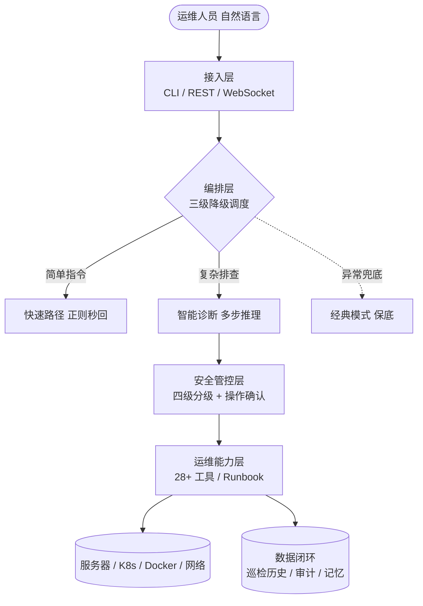

<div align="center">

# Keeper 简历项目素材（运维开发岗）

> 本文档把 Keeper 整理成可直接写进简历的项目素材，**面向「运维开发 / DevOps」岗位**。
> 写作侧重：**运维价值、架构设计、演进路线图、产品思维**；弱化纯软件开发细节。
>
> 所有数字与能力均来自项目本身，未做夸大，可放心引用。

</div>

---

## 目录

1. [项目一句话定位](#一项目一句话定位)
2. [简历精简版（可直接粘贴）](#二简历精简版可直接粘贴)
3. [一页纸极简版（3~4 行）](#三一页纸极简版34-行)
4. [架构设计亮点（运维价值导向）](#四架构设计亮点运维价值导向)
5. [演进路线图（体现产品思维）](#五演进路线图体现产品思维)
6. [产品思维的具体体现](#六产品思维的具体体现)
7. [面试问答准备](#七面试问答准备)
8. [关键数据速记](#八关键数据速记)
9. [写简历的注意事项](#九写简历的注意事项)

---

## 一、项目一句话定位

> **Keeper —— 面向一线运维的「对话式智能运维助手」，把 LLM 能力沉淀为可落地的运维工具链：用自然语言完成服务器 / K8s / Docker 的巡检、诊断、修复与标准化操作，降低运维门槛、防止误操作、沉淀团队经验。**

定位的关键不是「做了个 AI 应用」，而是「**用 AI 重构了运维工作流，并按运维真实诉求做了架构与产品规划**」。

---

## 二、简历精简版（可直接粘贴）

> **Keeper 智能运维助手（个人项目 · 负责需求规划、架构设计与落地）**
> *关键能力：运维自动化 · 智能诊断(LLM) · 安全管控 · K8s/Docker 运维 · 可观测性 · CLI/API 工具链*
>
> 针对「运维命令门槛高、排查靠经验、误操作风险大、SOP 难沉淀」四大痛点，设计并落地一套对话式智能运维工具：用户用自然语言下达需求，系统自动规划排查路线、调用运维工具、多步诊断并给出修复建议。
>
> - **架构上** 采用「三级降级」设计（快速指令 → 智能诊断 → 保底模式），保障在无网络 / 无大模型 / 依赖缺失等真实运维环境下**始终可用**。
> - **安全上** 设计四级命令分级 + 双层管控 + 操作前确认，从源头拦截 `rm -rf`、`dd` 等高危操作，满足生产环境安全红线。
> - **能力上** 沉淀 **28+ 运维工具**与 **Runbook 运维手册引擎**（YAML SOP 一键安装为可复用流程），覆盖巡检、日志、网络、K8s、Docker、安全扫描、证书监控、容量预测等场景。
> - **可观测上** 建设巡检历史(SQLite)、操作审计、跨会话记忆三条数据线，支撑趋势分析与容量预测。
> - **规划上** 主导 v1.0 → v1.1.0 演进（对齐业界最佳实践完成 8 项架构优化），并制定「自动采集 → 趋势溯源 → 主动告警」的产品路线图。

---

## 三、一页纸极简版（3~4 行）

> **Keeper 对话式智能运维助手（个人项目）** — Python / LLM / K8s / Docker / FastAPI
> 用自然语言驱动运维：自动规划排查路线、调用工具多步诊断、给出修复建议。
> 设计三级降级架构保障高可用、四级安全管控防误操作、Runbook 引擎沉淀团队 SOP；
> 沉淀 28+ 运维工具，建设巡检/审计/记忆数据闭环，并制定主动告警演进路线图。

---

## 四、架构设计亮点（运维价值导向）

不堆技术名词，而是讲**每个设计解决了什么运维问题**：

| 架构设计 | 解决的运维痛点 | 价值 |
| --- | --- | --- |
| **三级降级架构** | 运维环境千差万别（内网无法访问大模型、依赖没装、API 偶发故障） | **高可用**：任何环境都能退到可用档位，不会「一坏全坏」 |
| **双层安全管控** | 误操作是运维最大风险（删库、清错盘） | **安全红线**：高危命令硬拦截、写操作需确认、可审计 |
| **自服务引导** | 新人不会配 SSH / kubeconfig，遇错就卡住 | **降低门槛**：缺依赖 / 连不上时引导一步步解决，而非冷冰冰报错 |
| **Runbook 引擎** | 团队 SOP 写在文档里、执行靠人、易出错 | **经验沉淀**：把 SOP 变成可一键执行、可被智能调度的标准流程 |
| **数据闭环（巡检历史 / 审计 / 记忆）** | 运维缺乏溯源能力，「上周是不是也这样」 | **可观测 + 可追溯**：支撑趋势对比、容量预测、根因回溯 |
| **多形态接入（CLI / REST / WebSocket）** | 既要人工交互，也要接入现有监控 / 告警平台 | **可集成**：既能当顺手的命令行工具，也能被平台调用 |

> 架构思想一句话：**「可用性、安全性、易用性」优先于功能堆砌** —— 这正是运维系统该有的取舍。

### 架构分层示意



---

## 五、演进路线图（体现产品思维）

这是运维开发岗最该展示的部分 —— 说明**不是写完即止，而是有规划、分优先级、懂用户**。

```text
v1.0  基础能力            v1.1.0  架构成熟              v1.2+  规划中
────────────────►        ────────────────►            ────────────────►
意图路由 + 单步执行        多步推理 + 8 项架构优化         有记忆的运维管家
                                                       (差异化定位)
```

### 已交付：v1.1.0 八项架构优化（按 P0/P1/P2 优先级推进）

| 优先级 | 优化项 | 运维价值 |
| --- | --- | --- |
| **P0** | 工具权限前置 + 上下文注入 | 安全 + 让系统「开口前就懂当前环境」 |
| **P1** | 命令/工具分离、排查计划动态生成、状态总线 | 可维护 + 排查更有章法 |
| **P2** | 输出压缩、结构化提问、任务追踪 | 成本可控 + 体验顺手 |

### 规划中：从「执行任务」到「有记忆的运维管家」

| 阶段 | 目标 | 差异化价值 |
| --- | --- | --- |
| **P0 数据自动采集** | 每次巡检自动入库，打通「和三天前对比」「磁盘 7 天后将满」 | 从被动查询 → 主动数据积累 |
| **P1 时间线溯源** | 支持「上周三发生了什么」的事件追溯 | 运维记忆从「单次会话」→「跨天/周/月趋势」 |
| **P2 主动告警** | 检测异常趋势（如 CPU 连续 3 天上升）主动通知 | 从「等人来问」→「主动发现并预警」 |

### 差异化定位（产品思维核心）

明确对标 Claude Code，但锚定运维独有价值：

> *「Claude Code 记的是对话，Keeper 记的是**系统状态变迁**；不止回答『上次聊了什么』，而是能溯源『上周二 CPU 开始异常，与周三的部署有关』。」*

---

## 六、产品思维的具体体现

| 产品思维 | 在项目里怎么体现 |
| --- | --- |
| **明确用户与痛点** | 用户 = 一线运维 / 新人；痛点 = 门槛高、靠经验、怕误操作、SOP 难沉淀 |
| **优先级取舍** | 用 P0/P1/P2 划分需求，先做「安全 + 可用」再做「体验 + 智能」 |
| **MVP → 迭代** | v1.0 先跑通单步执行，v1.1 再升级多步推理与架构 |
| **差异化定位** | 不做「另一个 Claude Code」，而是聚焦运维记忆与状态溯源 |
| **可落地优先** | 非 TTY 自动降级、依赖缺失引导、本地优先 —— 都为真实运维环境考虑 |
| **目标体验先行** | 路线图里先画出「理想交互界面」（开场播报趋势 + 异常回顾），再倒推要做的能力 |

---

## 七、面试问答准备

面试官大概率追问的点，提前备好「故事」：

| 可能的提问 | 答题方向（STAR） |
| --- | --- |
| **为什么要做三级降级？** | 痛点：运维环境差异大（内网无大模型 / 依赖没装 / API 故障）。方案：每层处理不了交下一层，引擎自动探测可用档位。收益：保证「总能用」。 |
| **怎么保证不执行危险命令？** | 双层防御：工具级权限 + 命令级黑/灰/白名单四级；黑名单命令直接拒绝、连确认框都不弹；强调「纵深防御」。可讲成一个防误删的完整案例。 |
| **运维数据怎么沉淀和复用？** | 巡检历史(SQLite) + 审计日志 + 跨会话记忆三条线；支撑趋势对比、容量预测、根因回溯。 |
| **Runbook 有什么价值？** | 把团队 SOP 从「文档 + 人工执行」变成「可一键执行、可被智能调度的标准流程」，降低对人的依赖、减少出错。 |
| **后续怎么规划？** | 讲路线图：自动采集 → 时间线溯源 → 主动告警，从被动响应走向主动运维。 |

### 可主动暴露的「反思点」（展现成熟度）

- 智能诊断模式尚未集成定时任务（已在经典模式实现，待统一）；
- 部分能力存在重叠待收敛；
- 安全正则有被绕过的固有局限 —— 改进方向：命令语义解析 / 受限环境执行。

> 主动讲不足 + 给出改进方向，比假装完美更能体现工程成熟度。

---

## 八、关键数据速记

> 面试 / 简历中用到的真实数字（均来自项目本身）：

- **28+** 运维工具（支持动态扩展）
- **23** 种意图识别 + 约 **26** 条快速路径规则
- **3** 级降级架构（决策层 / 引擎层 / 语义层）
- **4** 级安全分级（只读 / 写 / 破坏性 / 高危）
- **6** 个内置排查模板 + 动态计划生成
- **3** 个内置 Runbook + 用户动态安装
- **8** 项 v1.1.0 架构优化
- **644+** 测试用例，核心逻辑模块覆盖率 **94%~100%**
- **3** 种接入形态：CLI / REST / WebSocket
- **2** 类 LLM Provider：OpenAI 兼容 / Anthropic

---

## 九、写简历的注意事项

1. **弱化「我会写代码」，强调「我懂运维 + 能落地系统」**：少讲框架内部实现，多讲「解决了什么运维问题、保障了什么」。
2. **路线图一定要讲**：体现规划能力和产品视角，这是运维开发区别于纯运维 / 纯开发的关键。
3. **量化用真实数字**：见上节，不编造 QPS / 用户量（个人项目编了反而露馅）。
4. **准备一个「安全」的故事**：运维岗最关心稳定与安全，把「双层安全管控如何防误删」讲成完整案例，很加分。
5. **附 GitHub 链接**：仓库已有完整 README + 项目白皮书，面试官点进去即加分。

---

<div align="center">

*本素材基于 Keeper 项目真实代码与文档整理，可根据具体 JD 进一步定制关键词与侧重点。*

</div>
